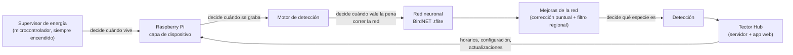
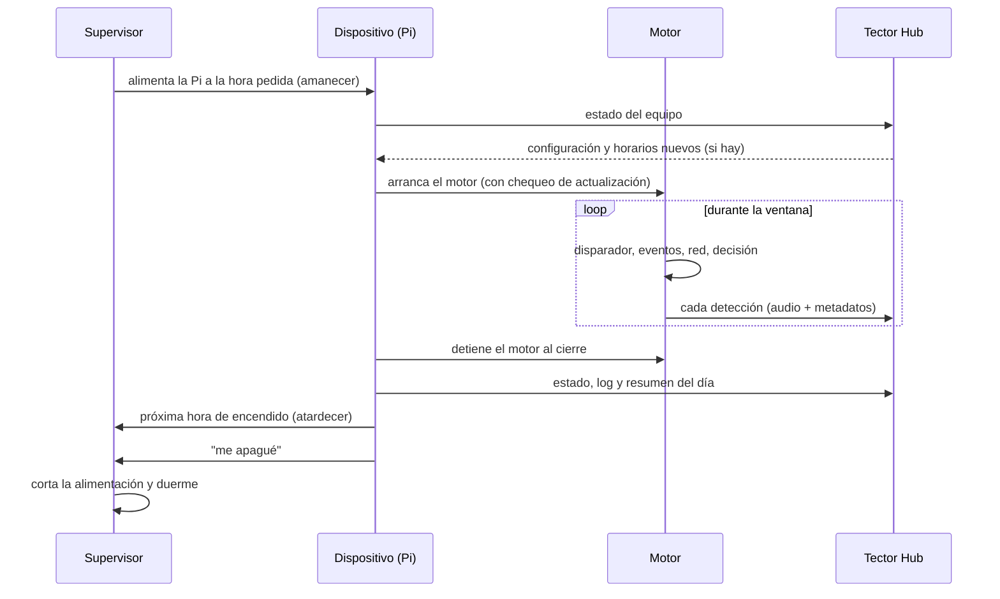

# Arquitectura general

Tector 2 se entiende mejor como una **cadena de decisiones**, cada una tomada por una pieza distinta:

1. **El supervisor de energía decide cuándo vive la Raspberry Pi.** Es un microcontrolador de muy bajo consumo
   que está siempre encendido. La Pi le pide a qué hora despertarla y le avisa cuando terminó; entre ventanas la
   Pi no existe (está sin alimentación). Este repositorio sólo describe la interfaz lógica con el supervisor
   (ver [`2_dispositivo`](../2_dispositivo/)).
2. **La capa de dispositivo decide cuándo se graba.** Calcula ventanas de amanecer y atardecer a partir de la
   ubicación, arranca el motor al abrir cada ventana, y al cerrarla publica su estado, baja configuración nueva,
   agenda el próximo despertar y se apaga. Ver [`2_dispositivo`](../2_dispositivo/).
3. **El motor decide cuándo vale la pena correr la red.** Graba en continuo, pero sólo invoca a la red cuando un
   disparador barato detecta actividad en la banda de las aves, y clasifica *eventos* completos, no fragmentos
   sueltos. Ver [`3_motor`](../3_motor/).
4. **La red, con sus dos mejoras, decide qué especie es.** BirdNET es la única pieza que no diseñamos; la
   tratamos como un cartucho intercambiable y lo rodeamos. Sobre su salida actúan una corrección puntual de
   confusiones y un filtro regional. Ver [`4_red`](../4_red/).
5. **Tector Hub cierra el ciclo.** Recibe las detecciones de todos los equipos, las muestra a los usuarios, les
   permite cambiar horarios y reportar audios mal etiquetados, y distribuye las actualizaciones. Los audios
   reportados son la materia prima de la corrección puntual. Ver [`5_hub`](../5_hub/).

## Tres sistemas de software, tres responsabilidades

| Sistema | Dónde corre | Responsabilidad | Documentación |
|---|---|---|---|
| Capa de dispositivo | Raspberry Pi del equipo | Ciclo de vida del equipo: ventanas, energía, red, estado, configuración | [`2_dispositivo`](../2_dispositivo/) |
| Motor de detección (TectorNET-Pi) | Raspberry Pi del equipo, como servicio | Audio → eventos → red → detecciones → envío | [`3_motor`](../3_motor/), [`4_red`](../4_red/) |
| Tector Hub | Servidor del laboratorio + navegador del usuario | Datos de todos los equipos, usuarios, configuración remota, actualizaciones | [`5_hub`](../5_hub/) |

Los tres se comunican **sólo a través de archivos y carpetas con formato acordado** (los "contratos",
ver [`6_interfaces`](../6_interfaces/)). Ninguno llama directamente al código de otro. Esto permite cambiar o
actualizar cualquiera de ellos sin tocar los demás, mientras respete el contrato.

## Principios de diseño

- **La energía la administra quien no la consume.** La computadora que gasta watts no decide cuándo prenderse:
  lo decide un circuito de microamperes.
- **La red es intercambiable; lo diseñado es lo que la rodea.** El modelo es un archivo; el disparador, los
  eventos, la decisión por racha, las correcciones y la logística de datos son nuestros.
- **Nada requiere ir al sitio.** Datos, configuración y actualizaciones viajan por la red. Las actualizaciones
  se verifican solas y se revierten si algo falla.
- **Falla segura.** Ante batería baja, falta de red o un cuelgue, el equipo prioriza sobrevivir y no perder datos:
  guarda localmente, reintenta después, se apaga ordenadamente.

## Flujo de un día

