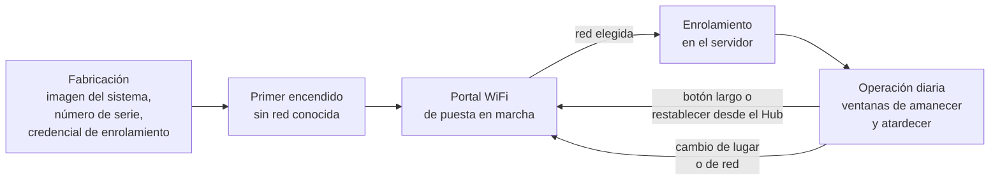
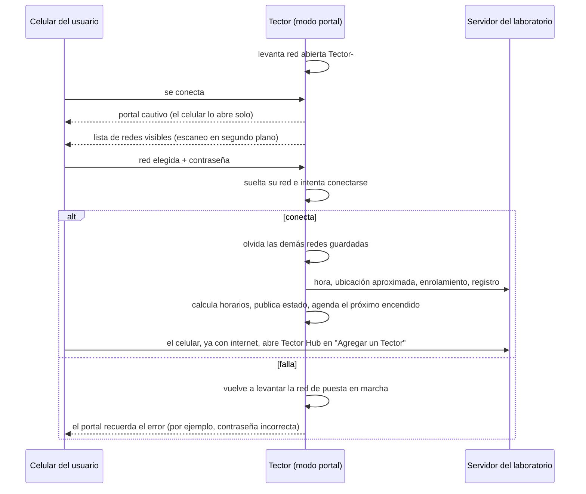
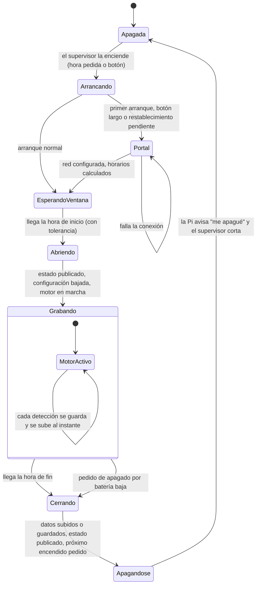
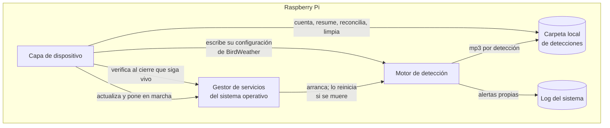
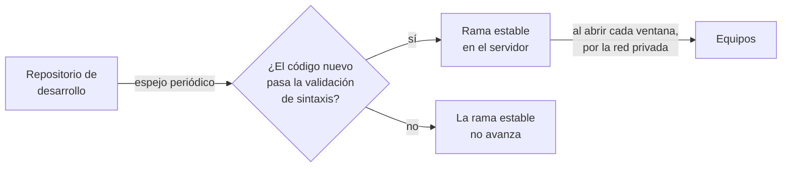

# Capa de dispositivo: el orquestador de la Raspberry Pi

La capa de dispositivo es el software que gobierna la vida de un Tector 2. No detecta aves (eso lo hace el motor)
ni muestra nada a los usuarios (eso lo hace Tector Hub): decide **cuándo** el equipo graba, **qué** sube y
**cómo** sobrevive sin nadie al lado.

Es, deliberadamente, un software "aburrido": scripts cortos que se disparan por tiempo o por evento, leen y
escriben archivos de texto con formato `CLAVE=valor`, y nunca dependen de que algo externo responda. Casi todo
lo que hace es *best-effort*: si una parte falla (no hay red, el servidor no contesta), la ventana de grabación
sigue igual y el intento se repite en la próxima.

## Índice

1. [Responsabilidades](#responsabilidades)
2. [Ciclo de vida de un equipo](#ciclo-de-vida-de-un-equipo)
3. [Un día del equipo como máquina de estados](#un-día-del-equipo-como-máquina-de-estados)
4. [Cálculo de las ventanas astronómicas](#cálculo-de-las-ventanas-astronómicas)
5. [Abrir una ventana](#abrir-una-ventana)
6. [Cerrar una ventana](#cerrar-una-ventana)
7. [Relación con el motor de detección](#relación-con-el-motor-de-detección)
8. [Configuración que baja del Hub](#configuración-que-baja-del-hub)
9. [Publicación del estado](#publicación-del-estado)
10. [Interfaz lógica con el supervisor de energía](#interfaz-lógica-con-el-supervisor-de-energía)
11. [La hora](#la-hora)
12. [Tolerancia a fallas](#tolerancia-a-fallas)
13. [Actualización del software](#actualización-del-software)
14. [Decisiones de diseño](#decisiones-de-diseño)

## Responsabilidades

| Responsabilidad | Qué significa en concreto |
|---|---|
| Identidad | Calcular y conservar el número de serie del equipo; registrarlo en el servidor. |
| Puesta en marcha | Levantar una red WiFi propia con un portal web para que el usuario elija la red del lugar. |
| Horarios | Calcular las ventanas de amanecer y atardecer a partir de la ubicación, la fecha y el huso horario. |
| Ventanas | Abrir y cerrar cada ventana: red, configuración, motor, subida de datos, estado, apagado. |
| Energía | Pedirle al supervisor la próxima hora de encendido, avisarle que terminó, obedecer pedidos de apagado. |
| Configuración remota | Bajar lo que escribió Tector Hub (horarios, BirdWeather, orden de restablecer) y aplicarlo. |
| Observabilidad | Publicar un `estado.json`, logs y resúmenes diarios para que el Hub sepa qué pasa sin hablar con el equipo. |
| Mantenimiento | Actualizar su propio software y el del motor desde el servidor del laboratorio. |
| Almacenamiento | Acotar el audio guardado en la tarjeta, borrando sólo lo que ya está a salvo en el servidor. |

Lo que **no** hace: no clasifica audio, no tiene base de datos, no expone ningún servicio a internet y no recibe
conexiones entrantes. Toda la comunicación la inicia el equipo.

## Ciclo de vida de un equipo



### 1. Fabricación y número de serie

Cada equipo sale del laboratorio con:

- una imagen del sistema operativo con la capa de dispositivo y el motor ya instalados;
- un **número de serie de cuatro dígitos**;
- una **credencial de enrolamiento** de un solo propósito (ver más abajo), distinta para cada equipo;
- la marca de "primer arranque" puesta, para que al encenderse vaya directo al portal.

El número de serie tiene que existir **antes** de que el equipo tenga internet, porque forma parte del nombre de
la red de puesta en marcha (`Tector-####-setup`). Por eso no se lo pide a ningún servidor: lo calcula solo, a
partir de un identificador fijo del procesador.

```
función número_de_serie():
    si ya hay uno guardado: devolverlo            # nunca cambia por sí solo
    id ← identificador del procesador             # sobrevive a reinstalar la tarjeta
         (o, si no existe, otro identificador estable del sistema)
    serie ← resumen_criptográfico(id) módulo 10000, con ceros a la izquierda
    guardar(serie, id)
    devolver serie
```

Dos propiedades que se buscaron:

- **Reproducible.** Si se reinstala la tarjeta, el mismo equipo físico vuelve a calcular el mismo número, y la
  etiqueta pegada en el gabinete sigue valiendo.
- **Corregible.** Cuatro dígitos pueden chocar (con N equipos, la probabilidad es del orden de N²/20000). El número
  calculado es una *propuesta*: al registrarse en el servidor, si ese número ya pertenece a otro hardware, el
  servidor devuelve uno libre y el equipo lo adopta. El servidor reconoce al mismo hardware aunque se registre mil
  veces, así que el registro es idempotente.

### 2. Primer encendido

Con la marca de primer arranque puesta, el equipo no intenta grabar: levanta la red de puesta en marcha y espera.
El mismo camino se recorre después de una pulsación larga del botón de reconfiguración o de un restablecimiento
pedido desde el Hub.

### 3. Portal WiFi de puesta en marcha



Detalles que importan:

- **Red abierta, sin contraseña.** El usuario no tiene que tipear nada para entrar. La red sólo existe mientras el
  equipo está en modo portal.
- **Portal cautivo.** Todo nombre de dominio se resuelve hacia el propio equipo, así que el celular detecta "red con
  portal" y abre la página solo, como en un hotel.
- **El mismo portal sirve a dos clientes.** Un formulario HTML para cualquier navegador y una pequeña interfaz JSON
  (información del equipo, redes, configurar, estado del último intento) para que la aplicación pueda dibujar la
  misma pantalla de forma nativa.
- **El aviso de éxito viaja al revés.** El equipo usa la misma antena para servir el portal y para conectarse a la
  red nueva: apenas empieza a conectarse, el portal desaparece y el celular pierde contacto. Por eso el portal le
  entrega al celular el número de serie *antes*, y es el celular el que, cuando recupera internet por cualquier vía,
  abre Tector Hub en el asistente de alta con ese número ya cargado.
- **Se olvidan las redes viejas sólo al tener éxito.** Así, una puesta en marcha abandonada a mitad de camino no deja
  al equipo sin ninguna red a la cual volver.
- **Al conectar, el equipo se ubica.** Con la red nueva consulta un servicio de geolocalización por IP para obtener
  coordenadas aproximadas, huso horario y país (este último ajusta la regulación del radio WiFi). Las coordenadas se
  pueden corregir después desde el Hub.
- **Revisión de fábrica.** El portal esconde una revisión de integridad que usa el laboratorio antes de entregar un
  equipo: verifica sin internet que estén el número de serie, la configuración, las credenciales, los servicios, el
  motor y el espacio en disco. Sólo si nada falla permite "dejarlo listo para entregar" (vuelve a poner la marca de
  primer arranque). No hay forma de forzarla.

### 4. Enrolamiento en el servidor

El equipo habla con el servidor del laboratorio por una **red privada virtual** (una VPN de malla): no hay puertos
abiertos en ningún lado y el equipo puede estar detrás de cualquier router. El problema es cómo entra a esa red un
equipo fabricado hoy e instalado dentro de meses, cuando cualquier clave de acceso grabada en fábrica ya habría
vencido.

La solución es en dos pasos (detalle del lado del servidor en [`5_hub`](../5_hub/#enrolamiento-de-un-equipo-nuevo)):

```
en fábrica:   el servidor genera un token para la serie y guarda sólo su resumen criptográfico;
              el token viaja en la tarjeta del equipo
primer arranque con internet:
    equipo  → servidor (público):  {serie, token}
    servidor → equipo:             clave de ingreso a la red privada, de un solo uso y de vida corta
    equipo: se une a la red privada; borra token y clave
```

Una vez adentro, el equipo queda identificado como "equipo de campo" y no necesita renovar nada. A partir de ahí
todo (registro, subida de datos, configuración, actualizaciones) viaja por la red privada.

Después del enrolamiento, en cada apertura y cierre de ventana, el equipo se **registra** contra el servidor con
`{serie, identificador de hardware}`. La respuesta es "ok" o "reasignado" (con un número nuevo); si no hay
respuesta, el equipo sigue funcionando igual y lo reintenta en la próxima ventana. El registro no es requisito para
grabar: sólo para aparecer en la aplicación.

### 5. Operación diaria

Es el estado normal y el resto de este documento lo describe.

## Un día del equipo como máquina de estados

Entre ventanas la Raspberry Pi **no existe**: está sin alimentación. Quien la enciende y la apaga es el supervisor
de energía, un microcontrolador siempre encendido de consumo mínimo. La Pi sólo vive para cumplir una ventana (o
para atender la puesta en marcha).



Visto en el tiempo, un día típico tiene dos ventanas y dos apagones largos:

```
00h         amanecer                                   atardecer                     24h
 |············[■■■■ ventana ■■■■]··························[■■■■ ventana ■■■■]···········|
  Pi apagada  ↑ enciende          ↑ cierra y se apaga       ↑ enciende         ↑ cierra
              el supervisor       pide "despertame al        el supervisor      pide "despertame
              a la hora pedida    atardecer"                                    mañana al amanecer"
```

## Cálculo de las ventanas astronómicas

Las ventanas siguen al sol, no al reloj: el coro del amanecer y la actividad del atardecer se corren con las
estaciones y con la latitud. El equipo calcula sus horarios **localmente**, sin red, a partir de sus coordenadas.

Parámetros (todos editables desde el Hub):

| Parámetro | Significado |
|---|---|
| Modo automático | Si está activo, los horarios se recalculan solos; si no, se usan horarios fijos escritos a mano. |
| Desplazamiento de amanecer / atardecer | Minutos respecto de la salida o puesta del sol (negativo = antes). |
| Duración de amanecer / atardecer | Horas que dura cada ventana (admite decimales). |
| Coordenadas | Las de la instalación; si el Hub escribió coordenadas propias, ganan esas. |

```
función calcular_ventanas(hoy):
    (lat, lon) ← coordenadas del Hub si son válidas, si no las de instalación
    zona ← huso horario político del punto (lat, lon)
           # por límites políticos, no por longitud/15: Argentina entera es UTC-3
           # aunque cruce varias franjas solares
           # si el punto no cae en ningún huso conocido, se usa uno por defecto

    puesta_hoy     ← puesta del sol(lat, lon, hoy)          en la zona
    salida_mañana  ← salida del sol(lat, lon, hoy + 1 día)  en la zona

    atardecer.inicio ← puesta_hoy + desplazamiento_atardecer
    atardecer.fin    ← atardecer.inicio + duración_atardecer
    amanecer.inicio  ← salida_mañana + desplazamiento_amanecer
    amanecer.fin     ← amanecer.inicio + duración_amanecer

    escribir horarios en el archivo de horarios (formato HH:MM, hora local)
    subir el archivo al servidor        # para que el Hub muestre los vigentes
```

Se recalcula al cerrar cada ventana, así que los horarios nunca tienen más de medio día de antigüedad. Un valor de
coordenadas roto que llegue del Hub se ignora: un error de tipeo no puede dejar al equipo sin horarios.

## Abrir una ventana

Un reloj de tareas revisa cada minuto si toca abrir. La condición **no** es "es exactamente la hora de inicio",
sino "ya pasó la hora de inicio, todavía no pasó la de fin, y hoy no abrí esta ventana". Así, un arranque lento o un
equipo ocupado en el minuto justo no pierde el día entero.

```
cada minuto:
    si no abrí hoy la ventana V  y  inicio(V) ≤ ahora < fin(V):
        marcar "V abierta hoy"
        limpiar marcas viejas de cierre forzado    # por si el cierre anterior no llegó a hacerlo
        registrar en el log: INICIO de V, fin esperado
        marcar ventana activa = V

        encender WiFi; esperar conectividad con unos pocos reintentos
        si hay red:
            subir log del sistema
            bajar archivo de horarios del servidor
            bajar y aplicar configuración remota (BirdWeather)
            publicar estado              # el Hub pasa a mostrar "grabando"
            actualizar la capa de dispositivo si hay versión nueva
            actualizar el motor si hay versión nueva (con chequeo de salud)
        poner el motor en marcha         # con red o sin ella: se graba igual
        # el WiFi queda encendido toda la ventana: el motor sube cada detección al instante
```

Una sutileza honesta: la hora de inicio **de esta** ventana ya se usó para encender el equipo, así que un cambio de
horario hecho desde el Hub nunca puede aplicar retroactivamente a la ventana en curso. Un cambio de *duración* sí
afecta al cierre de la ventana en curso, porque el archivo se baja al abrir. La aplicación se lo aclara al usuario
al confirmar.

## Cerrar una ventana

El cierre es el momento más cargado del día: es la única oportunidad garantizada de sincronizar todo antes de
desaparecer varias horas.

```
cada minuto:
    cierre_normal  ← no cerré hoy V  y  fin(V) ≤ ahora < fin(V) + margen
    cierre_forzado ← hay pedido de apagado por batería  y  ventana activa = V
    si cierre_normal o cierre_forzado:
        marcar "V cerrada hoy"; ventana activa = ninguna

        encender WiFi; esperar conectividad
        si no hay red:
            registrar en el log: FIN de V SIN CONEXIÓN, detecciones del período
            recalcular horarios localmente
            pedir al supervisor el próximo encendido
            apagarse                        # el audio queda en la tarjeta
            terminar

        sincronizar la hora (y pasársela al supervisor si es confiable)
        verificar que el motor siga vivo; si no, dejar ALERTA en el log
        borrar detecciones con fecha imposible (reloj perdido)
        subir todas las detecciones locales que falten
        si la subida salió bien:
            escribir el resumen del día y subirlo
            aplicar la retención local (borrar días viejos ya subidos)
        bajar archivo de horarios del servidor     # PRIMERO bajar...
        recalcular horarios                         # ...DESPUÉS recalcular
        registrar en el log: FIN de V, detecciones, próxima ventana
        subir logs; publicar estado
        pedir al supervisor el próximo encendido
        apagarse
```

Dos órdenes que no son arbitrarios:

- **Resumen antes que retención.** El resumen del día es una fila por detección (especie, confianza, hora) y pesa
  unos kilobytes frente a decenas de megabytes de audio. Es el dato científico y no se borra nunca. Si la limpieza
  corriera antes, un día podría irse sin haber quedado resumido.
- **Bajar antes de recalcular.** Al revés, el equipo recalcularía con el archivo viejo y lo subiría, pisando el
  cambio que el usuario acababa de hacer en el Hub.

Aunque el motor sube cada detección al instante, el cierre vuelve a subir la carpeta completa del día. Es una
**reconciliación**: cualquier archivo que no haya llegado (red caída en ese momento, servidor reiniciando) llega
ahora, y los que ya estaban no se repiten.

## Relación con el motor de detección

El motor (TectorNET-Pi) es otro programa, en otro repositorio, que corre como servicio del sistema operativo. La
capa de dispositivo y el motor **no se llaman entre sí**: se coordinan por el ciclo de vida del servicio y por
archivos.



| Relación | Cómo funciona |
|---|---|
| Lo arranca | Al abrir la ventana, después de buscar actualizaciones, la capa de dispositivo pone el servicio del motor en marcha. Se detiene con el apagado ordenado de la Pi al cierre. |
| Lo vigila (corto plazo) | El gestor de servicios lo reinicia solo si el proceso muere. |
| Lo vigila (largo plazo) | Al cerrar cada ventana se verifica que el servicio esté activo; si no, queda una línea de ALERTA en el log, que llega al servidor. Sirve para enterarse de un problema persistente sin ir al campo. |
| Le pasa configuración | El token de BirdWeather que escribe el Hub lo lee el motor, pero quien lo baja del servidor es la capa de dispositivo, que además le agrega las coordenadas del propio equipo. Sólo reinicia el motor si algo cambió (reiniciar sin motivo perdería el audio en curso). |
| Consume su salida | Cuenta las detecciones por ventana, arma el resumen diario, reconcilia la subida y aplica la retención local, todo leyendo la carpeta de detecciones con la convención de nombres del motor (ver [`6_interfaces`](../6_interfaces/#nombres-de-los-archivos-de-detección)). |
| Lo actualiza | Al abrir cada ventana corre el actualizador del motor (ver [Actualización](#actualización-del-software)). |

Se descartó que el motor bajara su propia configuración del servidor: lo ataría a cómo está armado el resto del
sistema. El motor sabe grabar, detectar y enviar; la capa de dispositivo es la que ya orquesta el ciclo y ya habla
con el servidor, así que el puente vive acá.

## Configuración que baja del Hub

El Hub nunca le habla al equipo: no puede, porque el equipo está apagado casi todo el día y, cuando está prendido,
vive detrás de un router ajeno. En cambio, el Hub **deja archivos** en la carpeta del equipo en el servidor y el
equipo los **baja** cuando puede. Los formatos están en [`6_interfaces`](../6_interfaces/).

| Archivo que deja el Hub | Cuándo lo baja el equipo | Qué hace con él |
|---|---|---|
| Horarios | Al abrir y al cerrar cada ventana | Lo usa como archivo de horarios local; recalcula si el modo es automático. |
| BirdWeather | Al abrir cada ventana | Instala token y coordenadas en la configuración del motor; reinicia el motor sólo si cambió. Token vacío = desconectar. |
| Orden de restablecer | En **cada** arranque, antes de decidir si va al portal | Borra audio, logs, resúmenes y configuración local; deja la marca de primer arranque; avisa al servidor que lo aplicó; recién al final olvida las redes WiFi. |

Notas sobre el restablecimiento:

- Se revisa en cada arranque, no en las ventanas, porque el arranque es el único punto por el que el equipo pasa
  siempre, tenga red guardada o no.
- Todo lo que necesita red (ver la orden, avisar que se aplicó, borrarla) se hace **antes** de borrar las redes
  guardadas. Al revés, el equipo quedaría sin forma de avisar y el Hub mostraría la orden pendiente para siempre.
- No se borra el canal de comunicación con el servidor (sin él no podría volver a reportar nunca), ni el archivo de
  horarios (sin él no habría ventanas que abrir para volver a pedirlo).
- El número de serie se recalcula del hardware y da el mismo: el equipo sigue siendo "el mismo" para el Hub.

## Publicación del estado

La aplicación no puede preguntarle nada al equipo. Todo lo que sabe, lo sabe por lo que el equipo sube. Para eso,
en tres momentos (al abrir ventana, al cerrarla y al terminar la puesta en marcha), el equipo:

1. se asegura de tener número de serie;
2. se registra en el servidor (si el servidor reasigna el número, el estado ya sale con el nuevo);
3. escribe `estado.json`, una foto chica y estable del equipo pensada para que la lea un programa;
4. lo sube a su carpeta.

Los campos están en [`6_interfaces`](../6_interfaces/#estadojson). La idea central: **un `estado.json` viejo es lo
normal**, porque el equipo duerme entre ventanas. El Hub decide que algo anda mal comparando la fecha del estado con
la próxima ventana anunciada: recién si pasó una ventana entera sin novedades hay algo que reportar.

Todo el paso es *best-effort*: perder una actualización del estado nunca justifica abortar una ventana.

Además del estado, el equipo sube:

- **Log del sistema** y **log reciente** (los últimos dos días, para no recorrer todo el historial);
- **Log de salud** (temperatura del procesador, estrangulamiento por temperatura o tensión, carga, frecuencia,
  tiempo encendido, disco, memoria), muestreado periódicamente mientras la Pi está prendida;
- **Log de batería**, armado con el registro que el supervisor acumula mientras la Pi está apagada (ver abajo);
- **Resumen diario** de detecciones.

## Interfaz lógica con el supervisor de energía

Este repositorio documenta sólo software. Del supervisor importa lo que la Pi **ve**: una contraparte con la que
intercambia mensajes cortos y que tiene la llave de su alimentación.

```mermaid
sequenceDiagram
    participant S as Supervisor de energía
    participant P as Pi (capa de dispositivo)
    Note over S: dormido; mide la batería cada tanto y guarda el registro
    S->>P: enciende la Pi a la hora pedida
    P->>S: ¿qué hora es? ¿arrancaste sin hora? ¿hubo batería baja?
    S-->>P: hora, indicadores, registro de batería
    P->>S: hora corregida (sólo si la Pi tiene una confiable)
    loop mientras la Pi está prendida
        P->>S: señal de vida
    end
    P->>S: despertame a las T (próxima ventana)
    P->>P: apagado ordenado del sistema operativo
    P->>S: "me apagué"
    S->>S: corta la alimentación y vuelve a dormir
```

### Mensajes

| Sentido | Mensaje | Uso |
|---|---|---|
| Pi → supervisor | **Despertame a tal hora** | Al cerrar una ventana (o al terminar la puesta en marcha), con el inicio de la próxima ventana. Hora absoluta en tiempo Unix UTC: el supervisor no necesita saber de husos. |
| Pi → supervisor | **Me apagué** | Al final del apagado ordenado. Recién ahí el supervisor corta la alimentación, así nunca se corta una Pi a mitad de una escritura. |
| Pi → supervisor | **Señal de vida** | Periódica, en todos los modos (también en el portal). Si deja de llegar más tiempo que un reinicio completo, el supervisor considera a la Pi colgada, la corta y la vuelve a encender. |
| Pi → supervisor | **Hora** | La Pi le pasa su hora cuando es confiable. |
| Pi → supervisor | **No conseguí hora** | Sin red y sin hora válida no hay horarios; el supervisor la vuelve a despertar cada algunas horas a reintentar. |
| Pi → supervisor | **Confirmaciones** | De los avisos que el supervisor repite hasta ser confirmados (modo configuración, batería baja registrada). |
| Supervisor → Pi | **Apagate en orden** | Batería por debajo del piso. La Pi cierra la ventana como un cierre forzado (sube lo que puede, publica estado con la marca de cierre forzado) y se apaga. Si no responde, el supervisor insiste y, pasado un tiempo, corta igual. |
| Supervisor → Pi | **Modo configuración** | Pulsación larga del botón de reconfiguración. Si la Pi estaba apagada, el supervisor la enciende primero, salvo que la batería no alcance. La Pi pone la marca de primer arranque y reinicia en modo portal. |
| Supervisor → Pi | **Hora e indicadores** | Al arrancar: su hora, "arranqué sin hora" y "la batería llegó al piso desde la última vez". |
| Supervisor → Pi | **Registro de batería** | Tensión, corriente y carga acumulada medidas mientras la Pi estaba apagada; la Pi lo sube al servidor. |

Reglas de software de la Pi:

- **Un solo dueño del canal.** Un único proceso de la Pi habla con el supervisor; el resto (cierres de ventana,
  puesta en marcha, sincronización de hora) le pide cosas a ese proceso. Dos lectores del mismo canal se roban los
  mensajes.
- **Mensajes enmarcados y verificados.** Todo lo que no sea un mensaje bien formado se ignora; el canal puede
  traer ruido durante los arranques.
- **La batería manda.** El botón no saltea el piso de batería: si no alcanza, el pedido de configuración se
  descarta (y queda registrado) en lugar de quedar pendiente y aparecer horas después en medio de una ventana.
- **El apagado lo inicia la Pi.** En operación normal nadie le corta la alimentación a la Pi: ella se apaga y avisa.
  El corte sin aviso queda reservado para una Pi colgada.

### Qué se informa al Hub

| Lo que dice el supervisor al arrancar | Interpretación | Qué hace el Hub |
|---|---|---|
| Sin hora + batería llegó al piso | La batería se agotó por completo y volvió con el sol | Lo registra |
| Sin hora, sin batería baja | Reinicio en frío (mantenimiento, reprogramación) | Sólo lo registra |
| Con hora + batería llegó al piso | Hubo un cierre por batería, pero sin agotarse | Sólo lo registra |

Hay un caso que el equipo no puede contar: si el supervisor deja de funcionar, la Pi queda apagada para siempre.
Ese caso lo detecta el Hub por ausencia (ver [`5_hub`](../5_hub/#avisos)).

## La hora

La Raspberry Pi no tiene reloj propio con respaldo: al encenderse, la hora se la da el supervisor, que la mantiene
mientras tenga batería. Como los horarios, los nombres de los archivos y las subidas dependen de la hora, las
reglas son estrictas:

```
al arrancar (antes que cualquier servicio que use la hora):
    si la red ya dio hora (NTP):        usar esa
    si no, si el supervisor tiene hora: usarla y marcar "hora confiable en este arranque"
    si no:                              avisar "sin hora" al supervisor

cada vez que hay conectividad real y NTP sincronizó:
    registrar la deriva (hora del supervisor − hora de red) en el log de salud y en el estado
    pasarle la hora al supervisor

nunca pasarle al supervisor una hora que no sea confiable
    # una hora "de la última vez que se apagó" pisaría una hora buena
```

La marca de "hora confiable" vive en memoria volátil y se borra en cada arranque: una marca que no sobrevive al
reinicio no puede quedar vieja.

Además, como red de seguridad, el equipo **descarta detecciones con fecha imposible** (anteriores a un piso de
fecha fijo) antes de subirlas: son las que se habrían grabado con el reloj perdido.

## Tolerancia a fallas

| Falla | Qué hace el equipo | Qué se pierde |
|---|---|---|
| Batería baja durante una ventana | El supervisor pide apagado; la Pi hace un cierre forzado (sube lo que puede, publica el estado con la marca de cierre forzado) y se apaga. | El resto de esa ventana. |
| Batería baja a la hora de despertar | El supervisor no enciende la Pi y reintenta más tarde. | Esa ventana. |
| Batería agotada del todo | Al volver el sol, el supervisor espera a tener margen, enciende la Pi, la Pi recupera la hora de la red y avisa. | Las ventanas del apagón. |
| Sin red al abrir | Se graba igual. | Nada: el estado del Hub queda viejo un rato. |
| Sin red al cerrar | Se recalculan los horarios localmente, se agenda el próximo encendido y se apaga. El audio queda en la tarjeta y se reconcilia en la próxima ventana con red. | Nada (hasta que la tarjeta se llene: la retención local sólo borra lo ya subido). |
| Sin red por días | Sigue grabando y acumulando. Sin hora de red usa la del supervisor. | Nada mientras haya espacio. |
| Servidor caído | Igual que "sin red" para la subida; el registro y la configuración se reintentan en la próxima ventana. | Nada. |
| Motor caído | El gestor de servicios lo reinicia; si persiste, ALERTA en el log al cierre. | Lo que no se grabó mientras estuvo caído. |
| Pi colgada | El supervisor deja de recibir señales de vida, corta y vuelve a encender. | Lo que estuviera en curso. |
| Reinicio a mitad de ventana | Al volver, la tolerancia de apertura reabre la ventana si todavía está en horario; las marcas de cierre forzado viejas se limpian al abrir. | Unos minutos. |
| Configuración remota rota | Coordenadas inválidas se ignoran; un archivo ausente es el caso normal. | Nada. |
| Actualización defectuosa | Ver abajo: el motor vuelve solo a la versión anterior; la capa de dispositivo sólo recibe versiones que pasaron validación. | Nada. |
| Tarjeta llenándose | Retención local por tamaño, borrando días enteros empezando por el más viejo, y sólo después de una subida exitosa. | Audio local viejo que ya está en el servidor. |

Principio común: **ninguna falla de red o de servidor interrumpe la grabación**, y **nada se borra localmente si no
está a salvo en otro lado**.

## Actualización del software

Los equipos **no hablan con GitHub**. Bajan su software del servidor del laboratorio, que mantiene un espejo de
cada repositorio con una rama estable:



El acceso de cada equipo es de **sólo lectura** y limitado a los dos repositorios que le corresponden (su capa de
dispositivo y el motor), con la misma credencial que usa para subir datos.

### Capa de dispositivo

```
al abrir ventana, con red:
    último ← preguntar al servidor por el último commit de la rama estable
    si último == instalado: terminar
    traer ese commit a un caché local (sin directorio de trabajo)
    para cada archivo de la lista blanca (scripts, programas, servicios):
        escribirlo a un temporal y reemplazar con un renombre atómico
        # seguro aunque el archivo reemplazado sea el que está corriendo
    nunca tocar: configuración del equipo, horarios, número de serie, credenciales
    si cambió el propio actualizador:
        volver a ejecutarse una vez con la versión nueva    # por si la lista blanca cambió
    marcar último como instalado
```

### Motor

```
al abrir ventana, con red:
    traer la rama estable del motor
    si no hay cambios: terminar
    reinstalar dependencias sólo si cambiaron
    reiniciar el servicio
    chequeo de salud:
        - la captura de audio tiene que aparecer en pocos segundos
        - el clasificador tiene que clasificar un audio de prueba
    si el chequeo falla: volver al commit anterior y reiniciar
```

La versión instalada viaja en `estado.json`, así que el Hub sabe qué corre cada equipo y puede avisar cuando
cambia.

## Decisiones de diseño

- **Archivos, no llamadas.** Todo intercambio con el Hub es un archivo en una carpeta. Un equipo que está apagado
  doce horas no puede atender pedidos; puede, en cambio, leer lo que le dejaron.
- **El equipo inicia toda conexión.** No hay puertos abiertos ni servicios expuestos en el equipo. Sólo el portal
  de puesta en marcha, en una red propia y temporal.
- **Tolerancia en vez de puntualidad.** Las ventanas se abren "si estamos dentro del horario y todavía no se abrió
  hoy", no "si es exactamente esta hora".
- **Estado mínimo y explícito.** Las marcas de estado (ventana activa, cierre forzado, primer arranque) son claves
  de texto que se modifican de a una, nunca reescribiendo el archivo entero: un corte de energía a mitad de
  escritura no puede dejar al equipo sin configuración.
- **La capa de dispositivo es un orquestador, no un motor.** Toda la inteligencia sobre audio vive en el motor; acá
  sólo hay ciclo de vida. Por eso se pueden actualizar por separado.
