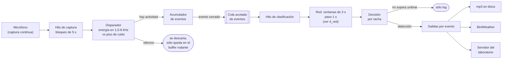
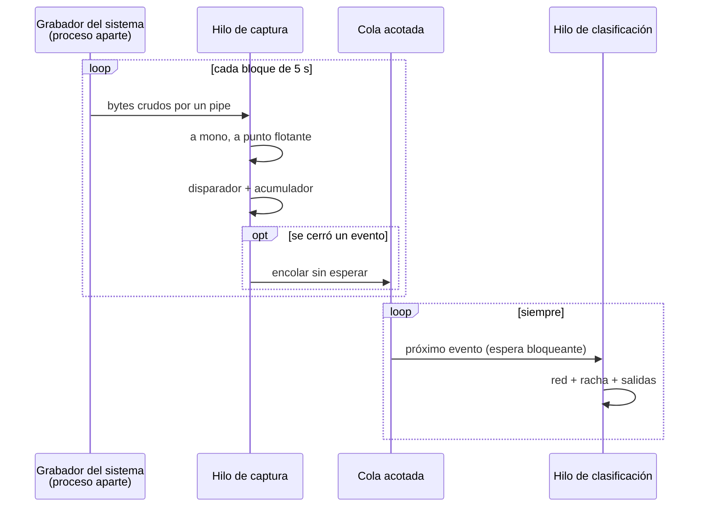
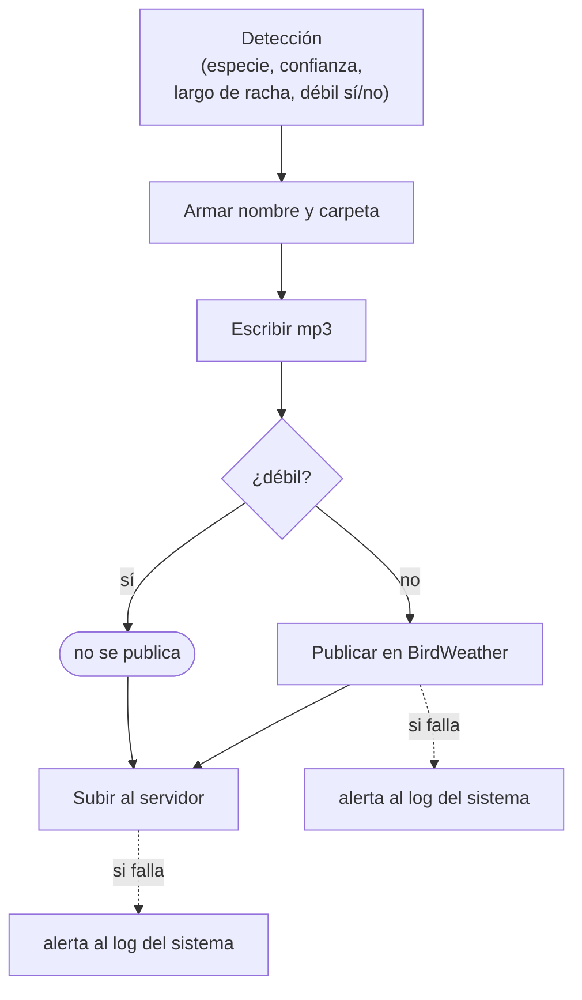
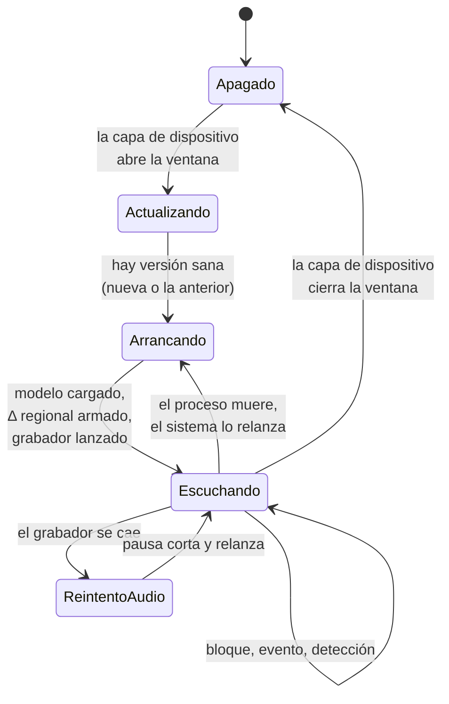

# 4. Motor de detección: TectorNET-Pi

TectorNET-Pi es el programa que, mientras la ventana de grabación está abierta, escucha el micrófono, decide
cuándo está pasando algo, le pregunta a la red neuronal qué ave es y entrega el resultado. Corre como un
servicio del sistema operativo en la Raspberry Pi del equipo, sin frameworks pesados de aprendizaje
automático: la red es un archivo `.tflite` (BirdNET V2.4) que se ejecuta con un intérprete liviano.

La idea de diseño más importante: **el motor es una arquitectura que rodea a un `.tflite`**. La red es
intercambiable; lo que diseñamos es todo lo que la rodea: cómo se captura el audio sin perder muestras, cómo
se evita correr la red sobre silencio, cómo se arma un evento completo, cómo se convierte una secuencia de
ventanas en una sola decisión, qué se hace con cada detección y cómo el equipo se mantiene sano solo en el
campo. Qué pasa adentro de la red (y el filtro regional que le sumamos) está en [`../4_red/`](../4_red/README.md).

Documentos de esta carpeta:

| Archivo | Qué cuenta |
|---|---|
| este README | arquitectura completa, contratos, ciclo de vida, modos de falla |
| [`pseudocodigo_disparador_y_eventos.md`](pseudocodigo_disparador_y_eventos.md) | disparador por energía, piso de ruido, acumulador de eventos |
| [`pseudocodigo_racha.md`](pseudocodigo_racha.md) | ventanas, decisión por racha, evidencia débil, salidas |
| [`autoactualizacion.md`](autoactualizacion.md) | actualización automática con chequeo de salud y vuelta atrás |

---

## 1. Vista general

Todo el trabajo de una detección (detectar, guardar, avisar, subir) es **una cadena por evento**: no hay
tareas programadas que pasen cada tanto a juntar resultados ni una base de datos intermedia. Apenas se cierra
un evento y la red lo identifica, sale para todos lados.

### Módulos y responsabilidades

| Módulo (conceptual) | Responsabilidad | No hace |
|---|---|---|
| Lazo principal | leer bloques del micrófono, alimentar al acumulador, encolar eventos | nunca clasifica ni hace red |
| Disparador | decir si en un tramo de audio hay energía por encima del piso de ruido | no sabe de especies |
| Acumulador de eventos | delimitar cada evento acústico (inicio real, fin por silencio o por tope) | no clasifica |
| Clasificador | cortar el evento en ventanas, correr la red, aplicar el filtro regional, decidir por racha | no escribe archivos |
| Exportador | armar nombre y carpeta del archivo según la detección | no codifica audio |
| Audio | escribir el mp3 | |
| BirdWeather | publicar la detección en la plataforma pública | |
| Subida | copiar el mp3 al servidor del laboratorio por la red privada | no reintenta |
| Verificador | prueba de humo del clasificador (la usa la autoactualización) | |
| Actualizador | traer versión nueva, reiniciar, chequear salud, volver atrás | |

Configuración en dos niveles:

- **Parámetros del algoritmo** (bandas, márgenes, tiempos, umbral): un archivo de texto `CLAVE = valor` que
  viaja con el repositorio, igual para todos los equipos, comentado línea por línea con el porqué de cada
  valor.
- **Datos del equipo** (qué tarjeta de audio, cuántos canales, identificador de estación en BirdWeather,
  coordenadas, provincia, destino en el servidor): archivos locales que no se versionan. Los escribe la capa
  de dispositivo durante la puesta en marcha y con la configuración que baja de Tector Hub.

---

## 2. Dos hilos y una cola

El motor tiene exactamente dos hilos de trabajo.

**Por qué dos hilos.** El grabador del sistema escribe a un pipe con un buffer muy chico: a la tasa de
muestreo de trabajo se llena en una fracción de segundo. Si el mismo hilo que lo lee se pusiera a correr la red
(cientos de milisegundos por ventana), el grabador se bloquearía y el sistema de audio perdería muestras
reales. Separando captura y clasificación, la captura nunca espera.

**Por qué hilos y no procesos.** El intérprete de la red y las operaciones numéricas pesadas liberan el
bloqueo global del intérprete de Python mientras calculan, así que un hilo alcanza. Pasar arrays de audio
entre procesos agregaría complejidad sin ganancia.

**Por qué la cola es acotada.** La cola no es una sala de espera: es una red de seguridad de memoria. Admite
unos pocos eventos; cada uno pesa como mucho la duración máxima de evento en audio mono. Si se llena, el
clasificador no da abasto con la actividad real del sitio y eso se registra como alerta. En ese caso se
**descarta el evento más nuevo**, no el más viejo: se prioriza terminar lo que ya está en curso antes que
acumular atraso.

---

## 3. Del bloque al evento

El detalle está en [`pseudocodigo_disparador_y_eventos.md`](pseudocodigo_disparador_y_eventos.md). Resumen:

1. **Bloques.** El audio llega en bloques de 5 s contiguos, cada uno con la hora de pared de su comienzo.
   Si el micrófono tiene más de un canal se promedia a mono. Un bloque chico da un piso de ruido más local y
   menos demora hasta evaluar si arrancó algo.
2. **Disparador.** Antes de gastar una sola corrida de la red, un chequeo barato: se filtra el bloque a la
   banda de 1,5 a 8 kHz, se calcula la energía (RMS en dB) en tramos cortos y se compara cada tramo contra el
   **piso de ruido del momento**, definido como un percentil bajo de esa misma energía. Hay actividad si algún
   tramo supera el piso por un margen fijo en dB. La banda se eligió comparando canto confirmado de muchas
   especies contra ruido de campo real: es más ancha que el pico de contraste a propósito, para no depender de
   que cada especie cante justo ahí. Arriba de 8 kHz casi no hay energía vocal y sí ruido.
3. **Inicio real.** El disparo puede caer en el medio de un canto. Por eso se mantiene siempre un **buffer
   rodante** con los últimos bloques, y el evento se reconstruye desde el primer tramo activo con ese contexto
   previo disponible.
4. **Piso de referencia congelado.** Al disparar, se mide el piso de ruido del contexto **anterior** al
   disparo y se usa como referencia para todo el evento. Si se recalculara sobre el propio evento (que puede
   ser ruidoso de punta a punta), el evento nunca se vería "en silencio respecto de sí mismo" y sólo cerraría
   por tope. La referencia se deja adaptar despacio, con un promedio móvil exponencial bloque a bloque, para
   seguir un ambiente que sube y se sostiene (viento, tránsito) sin cortar cantos reales.
5. **Cierre.** El evento crece cruzando bloques hasta que hay 1,5 s de silencio sostenido (medido contra la
   referencia) o hasta un tope de seguridad de unos 10 s. El 1,5 s sale de medir la distribución de pausas
   internas de cantos reales: con menos se partía un canto en dos con frecuencia apreciable. Al cerrar por
   silencio se recorta la cola dejando un poco de aire después del último sonido; al cerrar por tope se recorta
   exacto al tope.
6. Un evento demasiado corto (menos de un segundo) o sin hora de inicio se ignora.

---

## 4. Del evento a la decisión

El detalle está en [`pseudocodigo_racha.md`](pseudocodigo_racha.md) y el interior de la red en
[`../4_red/README.md`](../4_red/README.md). Resumen:

1. El evento se corta en **ventanas de 3 s con paso de 1 s** (solapadas 2 s). La última se completa con
   ceros.
2. Por cada ventana, la red devuelve un logit por clase. A esos logits se les suma el **término
   regional Δ** de la provincia del equipo, se pasa por una **sigmoide** con un factor de sensibilidad y se
   **enmascaran las clases que no son aves** (perros, motores, sirenas, ranas, grillos, mamíferos: 101 clases
   del catálogo que nunca pueden ganar). De cada ventana se queda la especie ganadora y su confianza.
3. **Decisión por racha.** Se buscan tramos de ventanas consecutivas con la misma especie ganadora. Cada racha
   se resume con un promedio de confianzas **ponderado por posición** (la primera ventana pesa 1, la segunda 2,
   y así): una racha que se sostiene gana peso a medida que avanza. Gana la especie con la mejor racha y recién
   ahí se compara contra el **umbral de 0,5**.
4. **Evidencia débil.** Si la racha ganadora tiene una o dos ventanas pero el evento tenía más, la detección se
   marca como débil: hubo algo, pero no se sostuvo.

Por qué así y no ventana por ventana: una ventana aislada de 3 s confunde con facilidad; un ave que realmente
está cantando sostiene la misma respuesta en varias ventanas solapadas. Clasificar el evento entero resuelve a
la vez dos problemas: la red decide con más contexto y el archivo que se entrega es el canto completo, no un
recorte arbitrario.

---

## 5. Salidas por evento

- **Archivo.** Un mp3 de alta tasa de bits, sin filtro pasabajos (para no recortar agudos que importan en
  aves), en una carpeta por fecha y por especie. El nombre lleva especie, confianza, fecha y hora de inicio
  del evento, más una marca si la evidencia fue débil:
  `<Especie>-<confianza>-<fecha>-<hora>[marca_débil].mp3`. Ese patrón es un **contrato**: el resumen de
  ventana que arma la capa de dispositivo y el servidor de Tector Hub cuentan y clasifican detecciones
  leyendo el nombre, sin abrir ninguna base de datos. La marca va después de la hora para que los contadores
  que buscan la hora no tengan que saber de ella.
- **BirdWeather.** Dos pedidos a la API pública: primero se sube el audio del evento como "soundscape" y,
  con el identificador que devuelve, se publica la detección. Sólo si el equipo tiene estación configurada y
  la detección no es débil. Las débiles se guardan y se suben igual, pero no se presentan como identificación
  firme en una plataforma pública.
- **Servidor del laboratorio.** Se copia el mp3, un archivo por vez, a la carpeta del equipo en el servidor
  por la red privada, con un tiempo límite. Desde ahí Tector Hub lo muestra en la aplicación.

Ninguna falla de salida detiene el lazo: se registra y se sigue con el próximo evento.

---

## 6. Ciclo de vida del servicio

- El motor es un **servicio del sistema** que se relanza solo si el proceso muere (con una pausa corta entre
  intentos). Arranca recién cuando el reloj del sistema ya tiene la hora correcta, porque la hora nombra los
  archivos.
- **Arranque:** lee la configuración, carga el modelo y las etiquetas, arma la máscara de no-aves (si la lista
  de no-aves nombra una etiqueta que no existe en el modelo es un error, no se ignora), arma una sola vez el
  vector Δ de la provincia, lanza el hilo de clasificación y recién después el grabador.
- **Durante la ventana:** el lazo de la sección 2, indefinidamente.
- **Cierre:** lo decide la capa de dispositivo (orquestador), que detiene el servicio, publica el estado,
  baja configuración, le pide al supervisor de energía la próxima hora de encendido y apaga. El motor no sabe
  de ventanas ni de energía: sólo escucha mientras lo dejan.
- **Registros:** un log propio del motor (cada evento, cada decisión, aunque no supere el umbral, con su
  mejor candidato) que queda en el equipo y rota solo; y las **alertas** importantes (fallas de subida o de
  BirdWeather, problemas de actualización) se escriben en el log del sistema que la capa de dispositivo sube
  al servidor en cada ventana. Así se ven desde el laboratorio sin entrar al equipo.

---

## 7. Autoactualización

Detalle en [`autoactualizacion.md`](autoactualizacion.md). En una línea: al abrir cada ventana, el equipo
consulta la rama estable del motor en el servidor del laboratorio; si hay versión nueva la aplica, reinicia el
servicio y **comprueba que esté sano clasificando un audio real de prueba**; si no lo está, vuelve solo a la
versión anterior. El principio rector es que **nunca quede el equipo sin un motor sano** por culpa de una
actualización.

---

## 8. Modos de falla y recuperación

| Falla | Qué la detecta | Qué hace el motor | Qué se pierde |
|---|---|---|---|
| El grabador muere (micrófono desconectado, error del sistema de audio) | el pipe entrega un bloque incompleto | cierra el grabador, espera unos segundos, lo relanza | el audio de esos segundos |
| La clasificación de un evento tira una excepción | el hilo de clasificación | registra y sigue con el próximo evento | ese evento |
| El clasificador no da abasto (mucha actividad) | la cola llena | descarta el evento más nuevo y registra alerta | eventos nuevos mientras dure |
| BirdWeather rechaza o no responde | error del pedido o tiempo límite | alerta al log del sistema, sigue | la publicación (el mp3 y la subida siguen) |
| No se puede subir al servidor | error o tiempo límite de la copia | alerta al log del sistema, no reintenta en el momento | nada: el mp3 queda en el disco del equipo |
| El proceso entero muere | el gestor de servicios | lo relanza tras una pausa corta | el evento en curso |
| Un evento abierto cuando se cierra la ventana | | | ese evento |
| Una versión nueva rompe el motor | chequeo de salud de la autoactualización | vuelve a la versión anterior y vuelve a chequear | nada |
| Ni la nueva ni la anterior pasan el chequeo | chequeo de salud | alerta crítica en el log del sistema | requiere revisión en persona |

Límites conocidos y aceptados:

- **El chequeo de salud necesita micrófono.** Sin micrófono el grabador no arranca y el actualizador interpreta
  que la versión nueva rompió el servicio, así que vuelve atrás.

---

## 9. Contratos con las otras capas

| Con quién | Qué recibe el motor | Qué entrega el motor |
|---|---|---|
| Capa de dispositivo | orden de arrancar y detener el servicio; archivos de configuración del equipo (audio, provincia, BirdWeather, destino) | log de alertas en el log del sistema; mp3 en la carpeta de detecciones (que la capa resume al cerrar la ventana) |
| Tector Hub (servidor) | versiones nuevas del motor por la rama estable | mp3 con nombre normalizado, uno por detección |
| BirdWeather | identificador de estación | soundscape + detección |
| La red (`../4_red`) | un modelo `.tflite`, sus etiquetas, la lista de no-aves y la base regional | ventanas de 3 s de audio |
