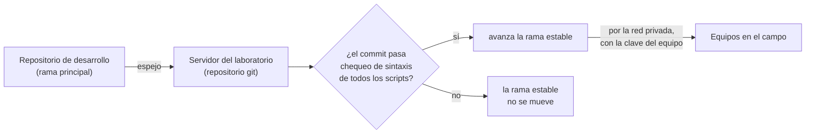
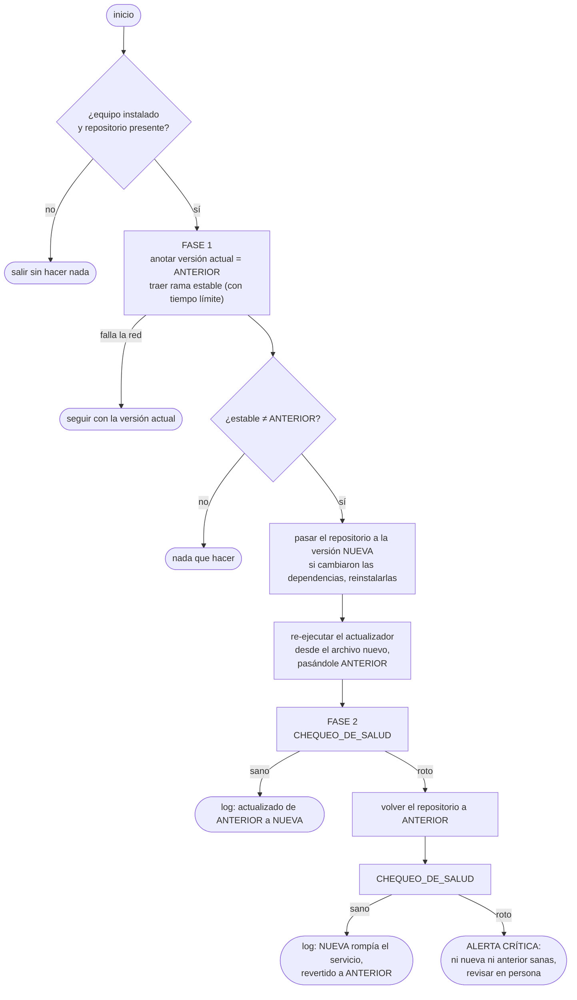

# Autoactualización con chequeo de salud y vuelta atrás

Los equipos están en el campo, sin nadie que entre a mirarlos mientras graban. Aun así queremos poder
corregir el motor (un parámetro, un error, una red con neuronas corregidas) sin ir a buscarlos. La
autoactualización resuelve eso con una regla que está por encima de todo lo demás:

> **Nunca dejar al equipo sin un motor de detección sano.** Si una versión nueva no pasa el chequeo de salud,
> se vuelve sola a la anterior, que ya se sabía sana.

## De dónde sale una versión



- Los equipos **nunca** bajan el motor de un servicio público: lo traen del servidor del laboratorio por la red
  privada, autenticándose con una clave propia del equipo.
- La rama que bajan, **estable**, es un espejo de la principal que sólo avanza si el commit pasa un chequeo
  estático barato (que todos los scripts al menos se puedan interpretar). Es un primer filtro; el chequeo que
  importa es el de salud, en el propio equipo.

## Cuándo corre

Al **abrir cada ventana de grabación**, la capa de dispositivo invoca al actualizador antes de dejar al motor
escuchando. Si no hay red o el servidor no contesta en un tiempo límite, se sigue con la versión instalada: una
actualización fallida nunca impide grabar.

## Las dos fases

El actualizador vive **dentro** del repositorio que él mismo reescribe. Si reescribiera su propio archivo y
siguiera leyéndolo, el intérprete de la consola podría ejecutar una mezcla de la versión vieja y la nueva. Por
eso trabaja en dos fases: la primera trae los cambios y **se vuelve a ejecutar desde cero** sobre el archivo ya
completo; la segunda, que ya corre la versión nueva del propio actualizador, hace el chequeo de salud.



## El chequeo de salud

"El servicio está activo" no alcanza. Como la captura está desacoplada de la clasificación (ver la sección 2
del [README](README.md)), un clasificador roto o colgado pasaría ese chequeo: la captura seguiría andando y la
cola simplemente nunca se vaciaría. Por eso el chequeo tiene dos partes:

```
función CHEQUEO_DE_SALUD():
    reiniciar el servicio del motor

    # 1. ¿Arranca y llega a escuchar?
    repetir cada 1 s, hasta un plazo generoso (del orden de un minuto):
        si el servicio está activo y el proceso grabador existe: seguir a la parte 2
    si se venció el plazo: registrar el motivo; devolver ROTO

    # 2. ¿Clasifica de verdad?
    correr la PRUEBA_DE_HUMO como proceso aparte, con un tiempo límite EXTERNO
    si terminó con error o la cortó el tiempo límite: registrar; devolver ROTO
    devolver SANO


función PRUEBA_DE_HUMO():                 # proceso independiente del servicio
    cargar el clasificador con los mismos archivos de modelo y configuración que usa el motor
    verificar que la máscara de no-aves tenga la cantidad esperada de clases,
        que clases conocidas de no-aves (un perro, una rana) estén enmascaradas
        y que aves conocidas (el Hornero, el Halconcito colorado) NO lo estén
    clasificar un audio real y corto que viaja dentro del repositorio
    verificar que el resultado tenga el formato esperado
    imprimir OK y terminar sin error
```

Decisiones de diseño del chequeo:

- **Sondear y no esperar un tiempo fijo.** Cuánto tarda en levantar el motor depende de la carga del equipo
  (temperatura, la instalación de dependencias que acaba de pasar). Una espera fija corta hace volver atrás
  versiones sanas; sondear cada segundo hasta un plazo generoso se adapta solo.
- **Tiempo límite externo y no un manejo de excepciones interno.** Un `try` adentro del programa atrapa
  errores, pero no un intérprete de la red que se cuelga. Correr la prueba como proceso aparte y matarlo desde
  afuera si no termina cubre las dos cosas.
- **Audio real, no sintético.** Lo que se valida es que toda la cadena corre (decodificar audio, armar
  ventanas, invocar la red, enmascarar, decidir), no que acierte la especie.
- **La prueba usa exactamente la misma función de construcción del clasificador que el motor**, así que no
  puede pasar la prueba una configuración distinta a la que corre en producción.

## Registro

Cada resultado (actualizado, revertido, alerta crítica, falla de red) se escribe en el **log del sistema** que
la capa de dispositivo sube al servidor al cerrar la ventana. Desde el laboratorio se ve qué versión corre cada
equipo y si alguna actualización tuvo que volverse atrás, sin entrar al equipo.

## Límite conocido

El chequeo de salud **necesita el micrófono conectado**: sin él, el grabador no aparece y la parte 1 falla.
El efecto es conservador (se vuelve a la versión anterior, que tampoco va a grabar sin micrófono, y queda la
alerta), pero significa que un equipo sin micrófono no se actualiza.
