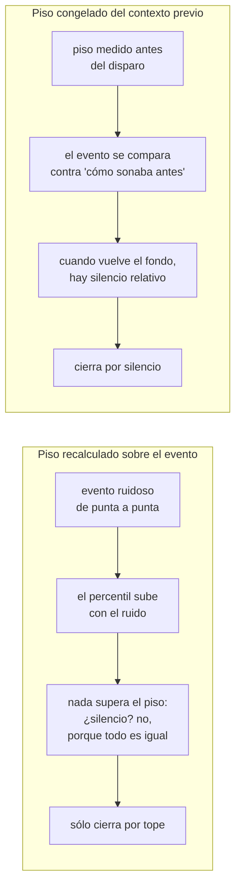

# Pseudocódigo: disparador, piso de ruido y acumulador de eventos

Este documento baja a pseudocódigo las secciones 2 y 3 del [README del motor](README.md). Es un nivel de
idea: suficiente para entender y razonar sobre el algoritmo, no para copiarlo. Los nombres de parámetros son
conceptuales.

## Parámetros conceptuales

| Parámetro | Significado | Valor o criterio |
|---|---|---|
| `DUR_BLOQUE` | largo de cada bloque leído del micrófono | 5 s |
| `BANDA` | banda donde se mide la energía | 1,5 a 8 kHz |
| `PERCENTIL_PISO` | percentil de la energía que se toma como piso de ruido | un percentil bajo |
| `MARGEN_DB` | cuánto por encima del piso cuenta como actividad | unos pocos dB, fijo |
| `N_BUFFER` | cuántos bloques anteriores se guardan siempre | un par |
| `SILENCIO_FIN` | silencio sostenido que cierra un evento | 1,5 s |
| `MARGEN_FINAL` | cuánto aire se deja después del último sonido | una fracción de `SILENCIO_FIN` |
| `DUR_MAX` | tope de seguridad de un evento | del orden de 10 s |
| `ALFA` | inercia del piso de referencia durante un evento | cercano a 1 (se adapta en pocos bloques) |

## Disparador

```
función ENERGIA_POR_TRAMO(audio):
    filtrado  ← filtro pasabanda(audio, BANDA)          # filtro de fase cero
    para cada tramo corto (del orden de 20 ms, con solapamiento):
        e[tramo] ← 20·log10(RMS(filtrado en el tramo))
    devolver e, tiempos de cada tramo

función PISO(audio):
    e, _ ← ENERGIA_POR_TRAMO(audio)
    devolver percentil(e, PERCENTIL_PISO)

función MASCARA_ACTIVIDAD(audio, piso_fijo = nada):
    e, t ← ENERGIA_POR_TRAMO(audio)
    piso ← piso_fijo si se dio, si no percentil(e, PERCENTIL_PISO)
    activo[tramo] ← e[tramo] > piso + MARGEN_DB
    devolver activo, t
```

Ideas clave:

- El piso es **relativo al momento**, no un valor absoluto: un percentil bajo de la propia energía describe
  "cómo suena el fondo ahora", sea un amanecer calmo o uno con viento.
- Un percentil bajo es robusto a picos breves: un canto ocupa una parte del bloque y no levanta el piso.
- El disparador no corre la red. Su costo es despreciable al lado de una inferencia, y es lo que permite que
  la red sólo trabaje cuando hay algo.

## Acumulador de eventos

Estado interno:

```
buffer        ← lista vacía     # últimos N_BUFFER bloques, el más viejo primero
evento        ← nada            # audio del evento en curso, o nada
hora_inicio   ← nada            # hora de pared del inicio del evento
piso_ref      ← nada            # piso de referencia del evento en curso
terminados    ← lista vacía     # eventos cerrados, para que el lazo principal los encole
```

Entrada: cada bloque, en orden y contiguo, con la hora de pared de su comienzo.

```
procedimiento PROCESAR_BLOQUE(bloque, hora_bloque):
    si evento es nada:
        BUSCAR_DISPARO(bloque, hora_bloque)
    si no:
        CONTINUAR_EVENTO(bloque)
    agregar bloque al final de buffer
    si buffer tiene más de N_BUFFER bloques: sacar el más viejo


procedimiento BUSCAR_DISPARO(bloque, hora_bloque):
    activo, t ← MASCARA_ACTIVIDAD(bloque)
    si ningún tramo activo: terminar                       # silencio: nada que hacer

    t_on ← tiempo del primer tramo activo dentro de bloque
    contexto ← concatenar(buffer)                         # lo que sonó antes de este bloque

    # Piso de referencia: del contexto ANTERIOR al disparo; si todavía no hay
    # contexto suficiente, del tramo de este bloque que está antes del onset.
    referencia ← contexto si es suficientemente largo, si no bloque[ antes de t_on ]
    piso_ref ← PISO(referencia) si referencia no es demasiado corta, si no nada

    disponible ← concatenar(contexto, bloque)
    evento     ← disponible desde el onset en adelante
    hora_inicio ← hora_bloque + t_on
    CHEQUEAR_FIN()


procedimiento CONTINUAR_EVENTO(bloque):
    evento ← concatenar(evento, bloque)
    si piso_ref no es nada:
        # Promedio móvil exponencial contra el piso de ESTE bloque, nunca
        # contra el evento acumulado entero.
        piso_ref ← ALFA·piso_ref + (1 − ALFA)·PISO(bloque)
    CHEQUEAR_FIN()


procedimiento CHEQUEAR_FIN():
    activo, t ← MASCARA_ACTIVIDAD(evento, piso_fijo = piso_ref)
    si hay algún tramo activo:
        silencio ← duración(evento) − fin del último tramo activo
    si no:
        silencio ← duración(evento)

    si duración(evento) ≥ DUR_MAX:      CERRAR(por_tope = verdadero)
    si no, si silencio ≥ SILENCIO_FIN:  CERRAR(por_tope = falso)


procedimiento CERRAR(por_tope):
    si por_tope:
        audio ← evento recortado exactamente a DUR_MAX
        # el tope se evalúa después de pegar un bloque entero, así que puede pasarse hasta un bloque
    si no:
        fin ← fin del último tramo activo (contra piso_ref) + MARGEN_FINAL
        audio ← evento recortado en fin
    agregar { audio, hora_inicio } a terminados
    evento, hora_inicio, piso_ref ← nada
```

## Por qué el piso de referencia se congela



La adaptación lenta (`ALFA`) cubre el caso contrario: si el ambiente sube y **se queda** alto (viento,
tránsito), un piso totalmente congelado vería actividad para siempre. Mezclándolo con el piso de cada bloque
nuevo, el piso alcanza al ambiente nuevo en unos pocos bloques; como cada bloque se resume con un percentil
bajo, una frase de canto no alcanza para arrastrarlo.

## Lazo principal (hilo de captura)

```
procedimiento LAZO_CAPTURA():
    repetir siempre:
        lanzar el grabador del sistema (tasa fija, 16 bits, canales del equipo) escribiendo a un pipe
        repetir:
            hora ← reloj de pared
            crudo ← leer exactamente DUR_BLOQUE de audio del pipe
            si llegó incompleto: salir de este repetir       # el grabador murió
            bloque ← a mono, a punto flotante en [−1, 1]
            PROCESAR_BLOQUE(bloque, hora)
            para cada evento en terminados (en orden):
                sacarlo de terminados
                intentar encolar sin esperar
                si la cola está llena: descartar ESTE evento y registrar alerta
        cerrar el grabador
        registrar "se cortó la captura"; esperar unos segundos       # y se relanza
```

El lazo nunca hace trabajo pesado: lo único que puede tardar es el disparador, que es barato. Todo lo demás
lo hace el hilo de clasificación, descripto en [`pseudocodigo_racha.md`](pseudocodigo_racha.md).
