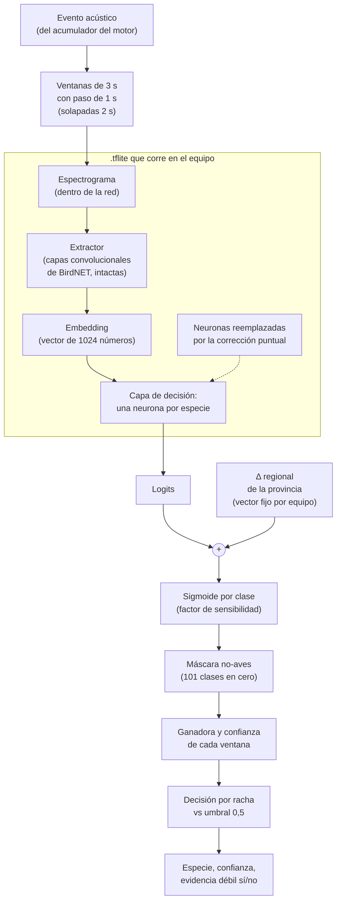

# 5. La red dentro del motor

Esta carpeta cuenta qué pasa entre que el motor de detección ([`../3_motor/`](../3_motor/README.md)) le entrega
a la red un evento acústico ya delimitado y que recibe de vuelta una especie con su confianza. La red de base
es **BirdNET V2.4**, en formato `.tflite`, con su catálogo global de clases. Sobre ella hicimos dos mejoras,
cada una con su documento:

| Archivo | Qué cuenta |
|---|---|
| este README | el flujo operacional completo, paso a paso |
| [`correccion_puntual.md`](correccion_puntual.md) | cómo se corrige una confusión puntual reentrenando sólo las neuronas involucradas |
| [`filtro_regional.md`](filtro_regional.md) | cómo se suma información de qué especies son esperables en la provincia |

Una forma de pensar las dos mejoras juntas, en palabras: por la regla de Bayes, la creencia final sobre una
especie combina **qué tan compatible es el sonido con esa especie** (la verosimilitud, lo que aporta el audio)
con **qué tan esperable es la especie ahí** (el prior). La corrección puntual arregla la primera parte en los
casos concretos donde la red confunde dos especies; el filtro regional arregla la segunda, porque la red fue
entrenada con datos mayormente del hemisferio norte y no sabe qué aves son comunes en cada provincia argentina.

---

## 1. Flujo completo



## 2. Paso a paso

### 2.1 Ventanas

El evento (de un par de segundos hasta unos 10 s) se corta en ventanas de **3 s** que avanzan de a **1 s**.
Tres segundos es el tamaño de entrada de BirdNET; el paso de un segundo hace que cada instante del canto caiga
en hasta tres ventanas distintas, con distinto contexto a cada lado. La última ventana se completa con ceros si
hace falta.

### 2.2 Espectrograma

La red recibe audio crudo y lo convierte internamente en un espectrograma: una imagen de tiempo contra
frecuencia, donde la intensidad de cada píxel es la energía del sonido en ese instante y esa banda. A partir de
acá, reconocer un ave es parecido a reconocer una forma en una imagen.

### 2.3 Extractor y embedding

La mayor parte de la red es un **extractor**: una pila de capas convolucionales que transforma el espectrograma
en un **embedding**, un vector de 1024 números que resume "cómo suena" esa ventana. Ventanas parecidas caen
cerca en ese espacio, y ventanas de especies distintas, en general, en zonas distintas. El extractor **no se
toca**: es la parte cara de entrenar y la que mejor generaliza.

### 2.4 Neuronas por especie

Sobre el embedding hay una capa de decisión con **una neurona por clase** del catálogo. Cada neurona hace una
cuenta lineal: un peso por cada componente del embedding, más un sesgo. El resultado es el **logit** de esa
clase, un número que, pasado por una sigmoide, se lee como "probabilidad de que esta especie esté presente". Las
neuronas son **independientes entre sí**: cada una responde su propia pregunta de sí o no, y varias pueden
estar altas a la vez.

### 2.5 Corrección puntual

Para las especies que la red confunde en nuestros sitios, la neurona original se **reemplaza** por una
reentrenada con una regresión logística binaria sobre el mismo embedding, usando audios mal etiquetados que
se reportaron en Tector Hub. El resto de las neuronas queda idéntico. Como la corrección
vive adentro del `.tflite`, el motor no se entera: recibe logits como siempre. Detalle en
[`correccion_puntual.md`](correccion_puntual.md).

### 2.6 Más Δ regional

A cada logit se le suma un término Δ que depende de la especie y de la provincia del equipo: positivo para las
especies más frecuentes que lo típico de la provincia, negativo para las menos frecuentes, cero si no hay datos.
El vector Δ se arma **una sola vez al arrancar** el motor, a partir de la provincia configurada para el equipo,
y se suma igual en todas las ventanas. Está acotado: **no bloquea ninguna especie**, sólo corre su logit una
cantidad limitada. Detalle en [`filtro_regional.md`](filtro_regional.md).

### 2.7 Sigmoide

El logit corregido pasa por una sigmoide, clase por clase. Un factor de sensibilidad estira o aplana la
sigmoide; se fijó junto con el umbral mirando audio de campo.

### 2.8 Máscara no-aves

El catálogo de BirdNET incluye 101 clases que no son aves: sonidos humanos y mecánicos (perros, motores,
sirenas, voces), anfibios, insectos y mamíferos. Para Tector esas clases no son una respuesta útil, así que su
puntaje se pone en **cero** después de la sigmoide: nunca pueden ganar una ventana. La lista es fija y se
deriva de la taxonomía de eBird (todo lo que no es especie de ave).

### 2.9 Racha

De cada ventana se toma la especie ganadora y su confianza. Esa secuencia se convierte en una sola decisión
por evento con la **decisión por racha** (ventanas consecutivas con la misma especie, promedio ponderado por
posición, umbral 0,5 sobre la mejor racha, evidencia débil si la racha es de una o dos ventanas dentro de un
evento más largo). Está detallada en
[`../3_motor/pseudocodigo_racha.md`](../3_motor/pseudocodigo_racha.md).

---

## 3. Pseudocódigo de una ventana

```
# al arrancar
red      ← modelo .tflite (extractor + capa de decisión con neuronas corregidas)
Δ        ← CONSTRUIR_DELTA(etiquetas, provincia_del_equipo)     # ver filtro_regional.md
no_ave   ← máscara de las 101 clases que no son aves

# por ventana
función PUNTAJES(ventana):
    e ← extractor(espectrograma(ventana))        # embedding de 1024
    z ← W · e + b                                # un logit por clase (W, b con filas corregidas)
    z ← z + Δ
    p ← sigmoide(sensibilidad · z)
    p[no_ave] ← 0
    devolver argmax(p), max(p)
```

## 4. Por qué el orden importa

- **La corrección va antes del Δ** porque arregla qué dice el sonido; el Δ agrega información que el sonido no
  tiene. Son dos fuentes de evidencia que se suman en escala de logit (log-odds), que es justamente donde
  sumar equivale a combinar evidencias independientes.
- **El Δ va antes de la sigmoide**, no después: sumado al logit es una corrección de prior bien definida;
  aplicado sobre la probabilidad habría que inventar cómo combinarlo.
- **La máscara va después de la sigmoide** y pone ceros: es un veto lógico, no una corrección probabilística.
- **La racha va al final** porque decide con todo el evento, no con una ventana.

## 5. Qué es intercambiable

El motor sólo le exige a la red un contrato: recibir 3 s de audio y devolver un logit por clase, con una lista
de etiquetas "nombre científico_nombre común". Mientras se cumpla, se puede cambiar el `.tflite` (por ejemplo,
con más neuronas corregidas) sin tocar una línea del motor; y el Δ se reconstruye solo a partir de esas
etiquetas.
