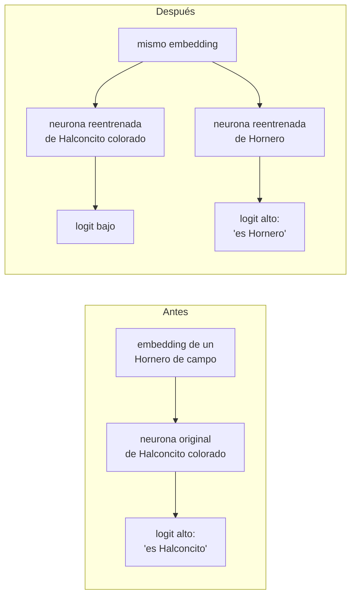
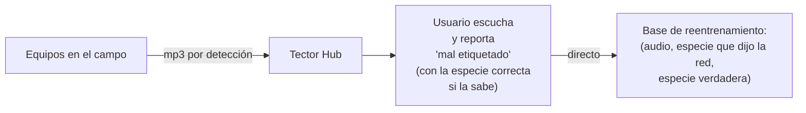
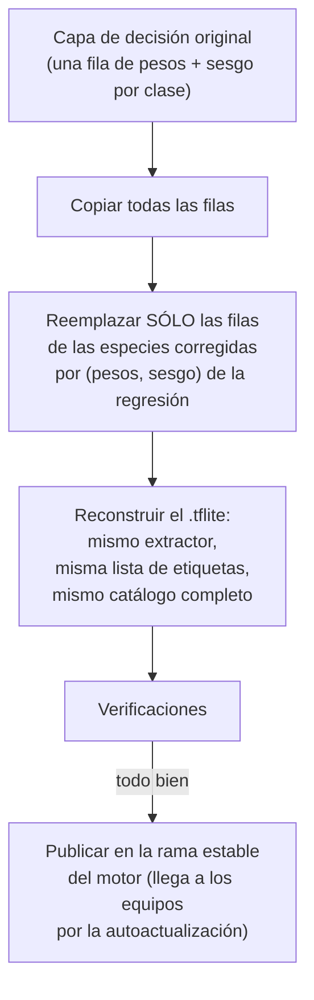
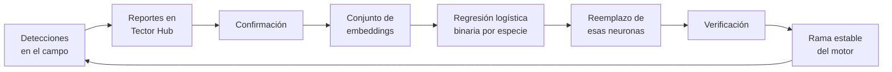

# Corrección puntual de confusiones

## 1. El problema

BirdNET es muy bueno en general, pero en un sitio concreto puede tener confusiones sistemáticas: una especie
local frecuente que la red etiqueta, una y otra vez, como otra especie. El caso que motivó todo este
procedimiento: en nuestros equipos, cantos de **Hornero** (*Furnarius rufus*) aparecían etiquetados como
**Halconcito colorado** (*Falco sparverius*). No es un error aleatorio: se repite con el mismo par, y por eso
se puede corregir de forma dirigida.

La observación clave que habilita la corrección: si se miran los **embeddings** (el vector de 1024 números
que la red calcula antes de decidir, ver [README](README.md)), los cantos de las dos especies **sí están
separados**. El extractor ya distingue los sonidos; lo que falla es la neurona de decisión, que traza el corte
en un lugar que no sirve para nuestro audio de campo. Entonces no hace falta reentrenar la red: alcanza con
volver a trazar ese corte.



## 2. Idea del método

Cada neurona de la capa de decisión de BirdNET es, matemáticamente, una **regresión logística binaria** sobre
el embedding: un peso por componente más un sesgo, y una sigmoide que convierte el resultado en "probabilidad
de que esta especie esté". Reentrenar una neurona es, entonces, ajustar una regresión logística binaria
**uno contra todos**: esta especie contra cualquier otra cosa. La ajustamos con scikit-learn, que lo hace en
segundos sobre embeddings ya calculados, y ponemos los pesos resultantes en el lugar de los originales.

Lo que cambia respecto del entrenamiento original de BirdNET son los **ejemplos**: además de grabaciones de
referencia, se usan audios reales de nuestros equipos, y en particular los **falsos positivos reportados**:

- como **negativos** de la especie confundida (la neurona de Halconcito colorado aprende a *no* responder a
  esos cantos), y
- como **positivos** de la especie verdadera (la neurona de Hornero aprende a responder a ellos tal como
  suenan en el campo).

## 3. De dónde salen los ejemplos



- **Reportes.** En la aplicación de Tector Hub cualquier usuario con acceso al equipo puede marcar un audio
  como mal etiquetado. El reporte entra **directo** a la base de reentrenamiento, sin paso intermedio, junto con
  el audio, la etiqueta que puso la red y la que indicó el usuario.
- **Cuándo se dispara una corrección.** Cuando un mismo par (especie que dijo la red, especie verdadera) se
  acumula de forma sistemática. Un reporte aislado no justifica tocar la red.

## 4. Cómo se arma el conjunto

Para cada neurona que se va a reentrenar (en el caso prototípico, dos: la de la especie confundida y la de la
verdadera), se arma un conjunto de embeddings con su etiqueta binaria:

| Tipo de ejemplo | Origen | Etiqueta en la neurona de la especie confundida (Halconcito) | Etiqueta en la neurona de la especie verdadera (Hornero) |
|---|---|---|---|
| falsos positivos reportados | reportes de Tector Hub (Hornero etiquetado como Halconcito) | 0 (negativo duro) | 1 |
| audio de campo de la especie verdadera | detecciones correctas de nuestros equipos | 0 | 1 |
| grabaciones de referencia de Halconcito colorado | colecciones públicas de cantos | 1 | 0 |
| grabaciones de referencia de Hornero | colecciones públicas de cantos | 0 | 1 |
| otras especies de la región | colecciones públicas y campo | 0 | 0 |
| especies ajenas a la región | colecciones públicas | 0 | 0 |
| audio sin aves (ruido, viento, sonidos cotidianos) | bancos públicos de sonidos ambientales | 0 | 0 |

Procedimiento:

1. **Embeddings, no audio.** Cada audio se corta en ventanas de 3 s igual que en el motor y cada ventana se pasa
   por el **mismo extractor que corre en el equipo**, con el mismo preprocesamiento. Se guardan los embeddings y
   el audio deja de hacer falta. Si el preprocesamiento de entrenamiento y el de producción difirieran, la
   neurona aprendería sobre una distribución que nunca va a ver.
2. **Separación por clip completo.** Antes de entrenar, los clips (no las ventanas) se separan en un grupo de
   entrenamiento y uno de validación. Si se separaran ventanas sueltas, ventanas solapadas del mismo canto
   caerían en los dos grupos y la validación mediría memoria, no generalización.
3. **Balance.** Los negativos son muchísimos más que los positivos; el ajuste pesa las clases para que la
   minoría cuente lo mismo que la mayoría.

## 5. Qué se entrena

Por cada especie involucrada, una regresión logística binaria (scikit-learn) sobre el embedding:

- entrada: embedding de 1024 componentes;
- salida: un peso por componente y un sesgo, es decir, exactamente la forma de una neurona de la capa de
  decisión;
- regularización: se prueba un rango corto de intensidades y se elige la que mejor rinde en el grupo de
  validación;
- pesos de clase balanceados.

Que el modelo sea **lineal** no es una limitación: es lo que hace que el resultado encaje en el lugar exacto de
la neurona original, sin cambiar la arquitectura de la red.

## 6. Cómo se inserta en la red



- Se reemplazan **sólo** las neuronas de las especies corregidas. Todas las demás quedan idénticas, bit a bit:
  la corrección no puede empeorar ninguna especie que no se tocó, por construcción.
- El catálogo y el orden de las etiquetas no cambian, así que la máscara de no-aves, el filtro regional y el
  motor siguen funcionando sin enterarse.
- La salida de la neurona nueva es un logit en la misma escala que el resto (una regresión logística también
  produce log-odds), así que se compara con las demás clases en igualdad de condiciones dentro de la decisión
  por racha y recibe el Δ regional como cualquier otra.

## 7. Cómo se verifica

Antes de publicar el modelo corregido:

1. **Las demás neuronas no cambiaron.** Comparación directa, fila por fila, de los pesos viejos y nuevos: sólo
   pueden diferir las filas corregidas.
2. **Sobre validación con audio real.** En el grupo de clips que no se usó para entrenar: los falsos positivos
   reportados ya no disparan la especie confundida y sí la verdadera, y los audios genuinos de la especie
   verdadera la siguen disparando.
3. **Con la cadena completa, no sólo con álgebra de pesos.** Los mismos audios se pasan por el pipeline real
   del motor (ventanas, Δ, sigmoide, máscara, racha) usando el `.tflite` reconstruido, para descartar errores
   de exportación.
4. **En el equipo.** El modelo nuevo llega como cualquier otra versión del motor y tiene que pasar el chequeo
   de salud de la autoactualización ([`../3_motor/autoactualizacion.md`](../3_motor/autoactualizacion.md)); si
   no, el equipo vuelve solo al modelo anterior.
5. **En el uso.** Se siguen mirando los reportes de Tector Hub: si el par corregido deja de aparecer, la
   corrección funcionó; si aparece un par nuevo, entra al mismo ciclo.

## 8. El ciclo completo



## 9. Pseudocódigo

```
# Entrada: base de reentrenamiento, pares reportados (audio, especie_dicha, especie_verdadera)
# Salida: modelo .tflite con algunas neuronas reemplazadas

procedimiento CORREGIR(reportados, modelo):
    afectadas ← { especie_dicha, especie_verdadera  para cada par sistemático en reportados }

    # 1. embeddings
    para cada clip en (reportados ∪ campo ∪ referencia ∪ ajenas ∪ sin_aves):
        clip.embeddings ← [ EXTRACTOR(modelo, v) para v en ventanas_3s_paso_1s(clip.audio) ]
        clip.especie    ← su especie verdadera (o "ninguna")
    entrenamiento, validación ← separar clips al azar POR CLIP

    W, b ← pesos y sesgos de la capa de decisión de modelo
    W_nuevo, b_nuevo ← copia(W, b)

    # 2. una regresión binaria uno contra todos por especie afectada
    para cada especie s en afectadas:
        X ← embeddings de los clips de entrenamiento
        y[ventana] ← 1 si su clip es de s, si no 0
        # los falsos positivos de s quedan con y = 0 (negativos duros) y,
        # como su especie verdadera es otra, con y = 1 en la neurona de esa otra
        mejor ← nada
        para cada intensidad de regularización en un rango corto:
            m ← REGRESION_LOGISTICA(X, y, pesos de clase balanceados, regularización)
            puntuar m sobre validación
            quedarse con el mejor
        W_nuevo[s], b_nuevo[s] ← coeficientes e intercepto de mejor

    # 3. inserción
    modelo_nuevo ← modelo con (W_nuevo, b_nuevo) en la capa de decisión, mismo extractor, mismas etiquetas

    # 4. verificación
    afirmar W_nuevo[c] = W[c] y b_nuevo[c] = b[c]  para toda clase c fuera de afectadas
    en validación, con la cadena completa del motor sobre modelo_nuevo:
        afirmar que los falsos positivos ya no dan la especie confundida
        afirmar que los positivos genuinos siguen dando su especie
    devolver modelo_nuevo
```

## 10. Qué no hace

- No toca el extractor ni ninguna otra neurona.
- No agrega especies al catálogo ni cambia su orden.
- No corrige confusiones que no fueron reportadas: es dirigida a propósito.
- No reemplaza al filtro regional: este corrige *qué dice el sonido*; el filtro agrega *qué es esperable en
  la provincia*. Ver [`filtro_regional.md`](filtro_regional.md).
