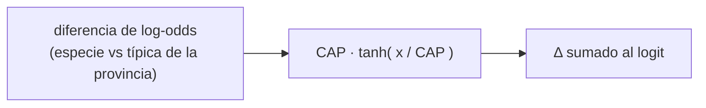
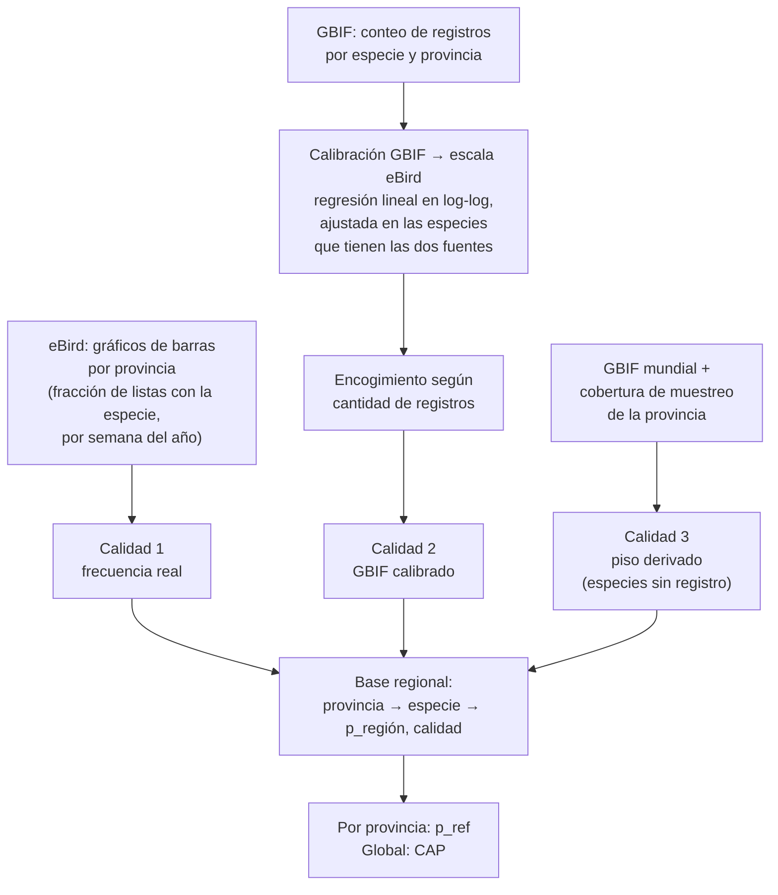

# Filtro regional

## 1. La idea, en palabras simples

Si escuchás un canto ambiguo en un parque de Buenos Aires, que suena "un poco a Hornero y un poco a una especie
que vive en Canadá", apostás por el Hornero. No porque el sonido lo diga mejor, sino porque **sabés qué aves son
comunes ahí**. Eso es la regla de Bayes:

> creencia final ∝ (qué tan compatible es el sonido con la especie) × (qué tan esperable es la especie ahí)

BirdNET aporta la primera parte, pero su "qué tan esperable" quedó fijado por los datos con que se entrenó,
mayormente del hemisferio norte y sesgados por dónde hay más grabaciones, no por dónde viven las aves. El filtro
regional **corrige ese prior**: le dice a la red, especie por especie, cuánto más o menos esperable es en la
provincia del equipo que en una especie típica de esa provincia.

Tres propiedades que buscamos, y que definen la fórmula:

1. **Sumar, no reemplazar.** El sonido sigue mandando; el filtro sólo inclina la balanza.
2. **Centrado en la provincia.** Una especie "típica" de la provincia no se mueve; las más frecuentes suben y
   las más raras bajan.
3. **Acotado: nunca bloquea.** Ninguna especie queda imposible. Una especie rara o vagante que suena clarísimo
   tiene que poder detectarse igual.

## 2. La fórmula

En escala de logit (log-odds), donde combinar evidencias es sumar:

```
logit_final(s) = logit_red(s) + Δ(s, provincia)

Δ(s, r) = CAP · tanh( [ logit(p_región(s, r)) − logit(p_ref(r)) ] / CAP )

con logit(p) = ln( p / (1 − p) )
```

- `p_región(s, r)`: frecuencia regional de la especie `s` en la provincia `r`, aproximadamente "en qué fracción
  de las salidas de observación de esa provincia aparece la especie" (sección 4).
- `logit(p_región) − logit(p_ref)`: cuánto más (o menos) frecuente es la especie que lo típico de la
  provincia, en log-odds. Es la corrección de prior "de libro": cambiar de un contexto a otro equivale a sumar
  la diferencia de log-odds de los priors.

### Qué es `p_ref`

`p_ref(r)` es la **frecuencia de referencia** de la provincia: la **media geométrica** de `p_región` entre las
especies con datos reales en esa provincia. Es el "punto cero": una especie con exactamente esa frecuencia
recibe Δ = 0.

- **Por qué de la propia provincia.** Lo correcto en teoría sería restar el prior con el que se entrenó la red,
  pero no lo conocemos. Estimarlo con frecuencias mundiales no sirve: están dominadas por el esfuerzo de
  muestreo de Norteamérica y Europa, y darían correcciones gigantes y espurias a las especies sudamericanas.
  Centrar contra la propia provincia compara a cada especie con su propio contexto.
- **Por qué media geométrica.** Las frecuencias se reparten en muchos órdenes de magnitud; la media geométrica
  es el centro natural en escala logarítmica, que es la escala donde trabaja la fórmula. Una media aritmética
  quedaría dominada por las pocas especies más comunes.

### Qué es `CAP`

`CAP` es el **tamaño máximo de la corrección**, en unidades de logit. Se toma como la **mediana** de
`|logit(p_región) − logit(p_ref)|` sobre las especies con datos de mayor calidad (sección 4). No se elige a
mano: sale de los datos y se recalcula cada vez que se reconstruye la base regional.

- **Por qué la mediana.** Con la mediana, la mitad de las especies recibe una corrección prácticamente lineal (la
  zona donde la tanh es casi una recta) y la otra mitad empieza a saturar. Probamos con un percentil alto y la
  corrección quedaba tan grande que, ante audio ambiguo, las especies más comunes de la provincia ganaban
  aunque el sonido no las sostuviera: el filtro pasaba de inclinar la balanza a decidir solo.

### Por qué `tanh` y la saturación



```
 Δ
 +CAP ┤                         ____________________
      │                    ___/
      │                 _/
    0 ┼--------------/--------------------------------  x
      │           _/
      │       ___/
 −CAP ┤______/
       muy rara      típica          muy común
```

- **Cerca de cero, Δ ≈ x**: para especies no muy lejos de lo típico la corrección es la de Bayes sin tocar.
- **Lejos de cero, Δ se acerca a ±CAP sin pasarlo**: una especie extremadamente común sigue sumando un poco más
  que una moderadamente común (la curva sigue subiendo), pero con rendimientos decrecientes. Ninguna especie
  recibe una ventaja ilimitada.
- **Nunca bloquea**: lo más que baja una especie es `CAP` en logit. Si el sonido es suficientemente claro, la
  especie gana igual. Por eso el filtro se puede aplicar en todas las provincias sin miedo a "apagar" vagantes,
  migrantes o especies mal muestreadas.
- **Por qué no un recorte duro** (cortar en ±CAP): con un recorte, decenas de especies con frecuencias muy
  distintas quedarían con el mismo Δ exacto, y se perdería justamente la información de cuál es más común. La
  tanh satura suave y conserva el orden.

## 3. Dónde entra en la red

El Δ se suma al logit **después** de la capa de decisión y **antes** de la sigmoide y de la máscara de no-aves. El
flujo completo está en el [README](README.md).

## 4. Fuentes de datos

La base regional se construye una vez, fuera del equipo, y viaja con el motor.



- **eBird (calidad 1).** El gráfico de barras de eBird dice, para una provincia, en qué fracción de las listas
  de observación aparece cada especie. Es la medida más directa de "qué tan esperable es encontrarla", pero no
  está disponible con el mismo detalle para todas las provincias.
- **GBIF calibrado contra eBird (calidad 2).** GBIF tiene registros de ocurrencia para todas las provincias, pero
  en otra escala: cuenta registros, no fracción de listas. Para pasarlo a la escala de eBird, en las provincias
  donde hay ambas fuentes se ajusta una **regresión lineal entre los logaritmos** (log de la frecuencia de eBird
  contra log de la proporción de registros de GBIF). La correlación resulta muy alta, así que esa recta se usa
  para convertir la proporción de GBIF a frecuencia equivalente en el resto de las provincias. Una especie con
  muy pocos registros tiene una proporción poco confiable, así que se **encoge** hacia la frecuencia de
  referencia de la provincia, más cuanto menos registros tiene (un estimador bayesiano empírico: con muchos
  registros manda el dato, con pocos manda la referencia).
- **Especies sin registro (calidad 3).** Para las especies del catálogo que no tienen ningún registro en la
  provincia no se pone un mismo valor fijo para todas. Se deriva un piso bajo que depende de qué tan bien
  muestreada está la provincia (en una provincia muy muestreada, no aparecer nunca dice más) y de qué tan común
  es la especie en el resto del mundo (una especie abundante en otro lado es más plausible como vagante que una
  rara en todas partes). Ese piso nunca supera a la especie documentada más rara de la provincia.
- **p_ref** se calcula por provincia sólo con especies de calidad 1 y 2. **CAP** se calcula con las de
  calidad 1.

## 5. Cómo se aplica por provincia

- Cada equipo tiene configurada su **provincia** (un código fijo, que sale de la ubicación del equipo cargada
  en la puesta en marcha o desde Tector Hub). No hace falta geolocalizar nada en el equipo.
- Al **arrancar el motor**, se recorre la lista de etiquetas del modelo, se toma el nombre científico de cada una,
  se busca su `p_región` en la base para esa provincia y se calcula su Δ. El resultado es un vector, una
  entrada por clase, que se suma igual en todas las ventanas hasta el próximo arranque.
- Si el equipo cambia de provincia, basta con cambiar la configuración: el vector se rearma en el siguiente
  arranque.
- La base usa la frecuencia anual promedio. Los datos de eBird traen variación semanal y la fórmula admite usar
  la semana del año en lugar del promedio cuando la especie tiene ese dato.

## 6. Qué pasa si no hay datos

| Situación | Δ |
|---|---|
| la provincia no está en la base (por ejemplo, un equipo fuera del país) | **0 para todas las especies**: la red funciona exactamente como sin filtro |
| la clase no es una especie de ave o su nombre no está en la base | **0**: neutro, ni premio ni castigo |
| la especie está en la base pero sin registros en la provincia | negativo, a partir del piso derivado (calidad 3), acotado por `CAP` |
| la especie tiene datos reales | el valor de la fórmula |

El criterio general: **la falta de datos nunca inventa un castigo ni un premio**. Donde no sabemos nada, el
filtro se hace a un lado.

## 7. Pseudocódigo

```
# Fuera del equipo, cuando se reconstruye la base
procedimiento CONSTRUIR_BASE():
    para cada provincia r con gráfico de barras de eBird:
        p[r][s] ← fracción de listas con s (promedio anual; opcionalmente por semana)   # calidad 1
    a, pendiente ← ajustar  ln(p_eBird) = a + pendiente · ln(proporción_GBIF)
                   sobre las especies con ambas fuentes
    para cada provincia r, para cada especie s sin calidad 1 y con registros en GBIF:
        p_cal ← exp( a + pendiente · ln(proporción_GBIF[r][s]) )
        peso  ← n_registros / (n_registros + K)                # encogimiento
        p[r][s] ← peso · p_cal + (1 − peso) · referencia_preliminar[r]               # calidad 2
    para cada provincia r, para cada especie s del catálogo sin registros:
        p[r][s] ← min( piso(r) · forma_global(s), mínima p documentada en r )         # calidad 3
    para cada provincia r:
        p_ref[r] ← media geométrica de p[r][s] para s de calidad 1 o 2
    CAP ← mediana de | logit(p[r][s]) − logit(p_ref[r]) |  sobre s de calidad 1
    guardar base, p_ref, CAP


# En el equipo, al arrancar el motor
función CONSTRUIR_DELTA(etiquetas, provincia):
    Δ ← vector de ceros, uno por etiqueta
    si provincia no está en la base: devolver Δ                  # neutro
    para cada índice i, etiqueta en etiquetas:
        s ← nombre científico de la etiqueta
        si s no está en la base de la provincia: seguir           # Δ[i] queda en 0
        x ← logit(p[provincia][s]) − logit(p_ref[provincia])
        Δ[i] ← CAP · tanh(x / CAP)
    devolver Δ


# En el equipo, en cada ventana
z ← logits_de_la_red(ventana) + Δ
```

## 8. Qué no hace

- **No bloquea especies.** No hay una lista de "especies permitidas": todas compiten, unas con un empujón y
  otras con un freno acotado.
- **No mira el audio.** Δ depende sólo de la especie y la provincia; el mismo para todos los eventos del equipo.
- **No corrige confusiones acústicas puntuales.** Si la red confunde dos especies igualmente comunes en la
  provincia, el filtro no las separa. Esas confusiones se corrigen de forma puntual, ajustando las neuronas de decisión involucradas.
