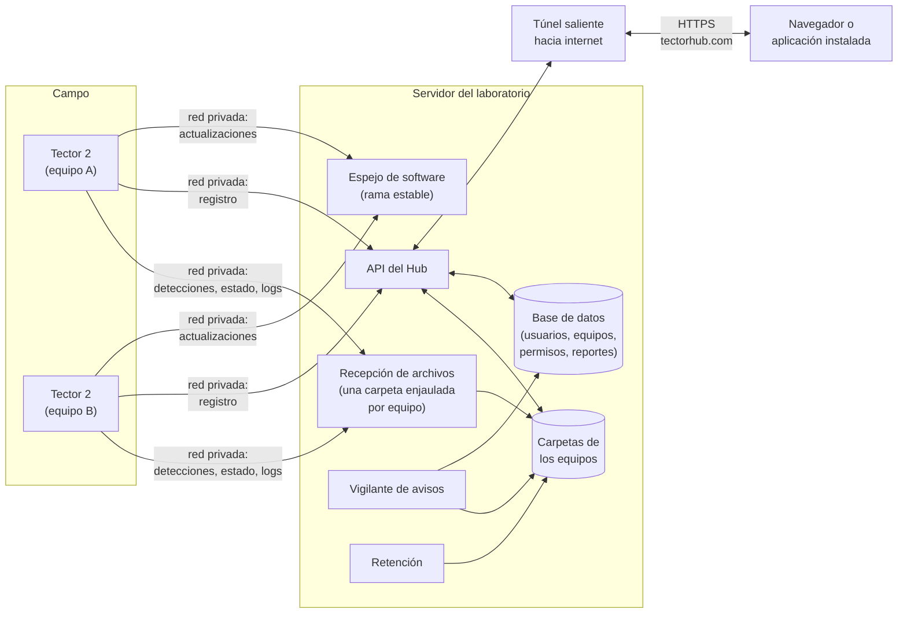
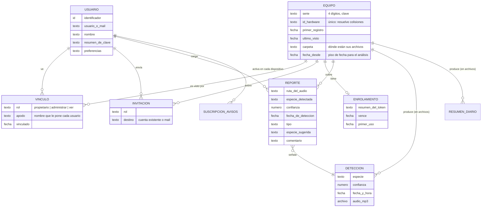
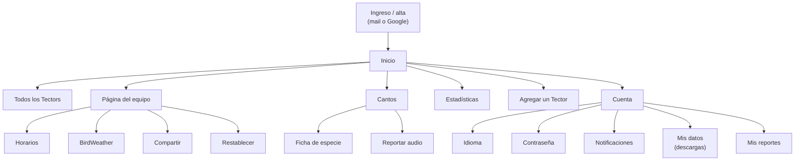
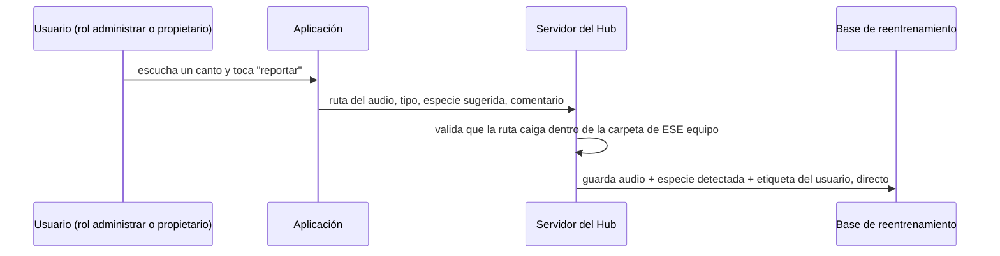
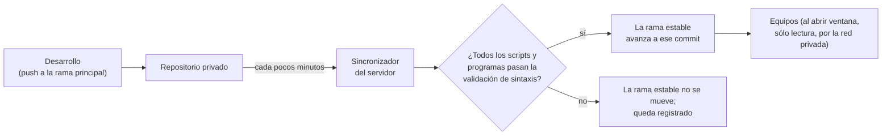
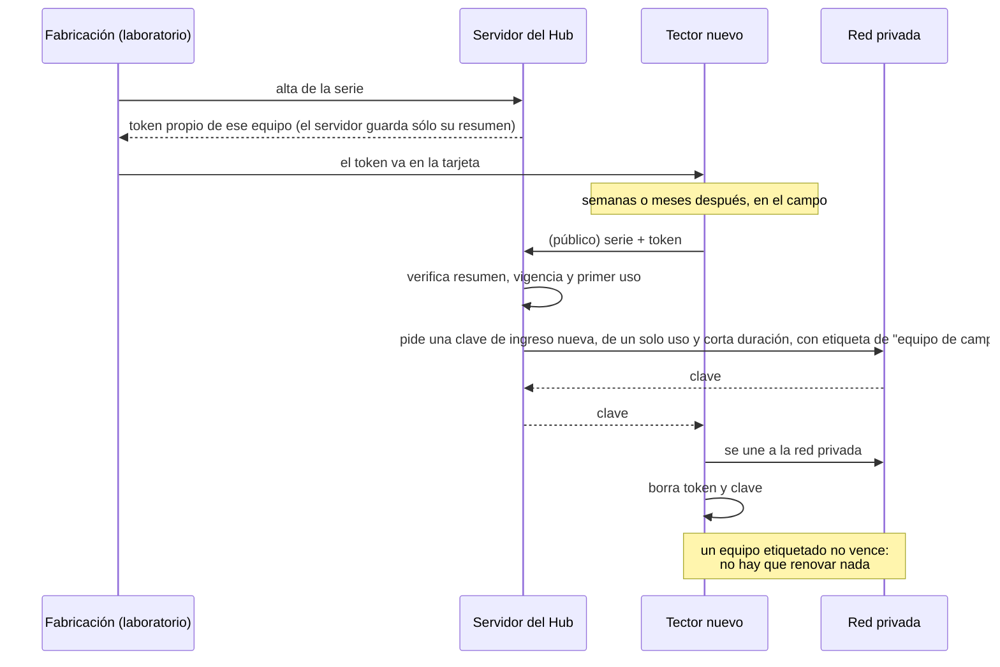

# Tector Hub: servidor y aplicación

Tector Hub es el lugar donde terminan los datos de todos los Tector y desde donde se los administra. Tiene dos
mitades: un **servidor** que corre en una computadora del laboratorio y una **aplicación web instalable** que usa
cualquier persona desde el celular o la computadora, en [tectorhub.com](https://tectorhub.com).

El Hub no habla nunca con los equipos en vivo. Los equipos suben archivos a su carpeta en el servidor y bajan de
ahí lo que el Hub les dejó (ver [`6_interfaces`](../6_interfaces/)). El Hub es, en el fondo, **un lector y escritor
de esas carpetas** con usuarios, permisos y una interfaz amable encima.

## Índice

1. [Arquitectura](#arquitectura)
2. [Modelo de datos conceptual](#modelo-de-datos-conceptual)
3. [Usuarios, equipos y permisos](#usuarios-equipos-y-permisos)
4. [Funciones para el usuario](#funciones-para-el-usuario)
5. [Reporte de audios mal etiquetados](#reporte-de-audios-mal-etiquetados)
6. [Escribir horarios y configuración de un equipo](#escribir-horarios-y-configuración-de-un-equipo)
7. [Avisos](#avisos)
8. [Distribución de actualizaciones](#distribución-de-actualizaciones)
9. [Enrolamiento de un equipo nuevo](#enrolamiento-de-un-equipo-nuevo)
10. [Retención de datos](#retención-de-datos)
11. [Seguridad](#seguridad)
12. [Decisiones de diseño](#decisiones-de-diseño)

## Arquitectura



| Pieza | Qué es | Notas |
|---|---|---|
| Servidor del laboratorio | Una computadora con Linux en el laboratorio | Aloja todo lo de abajo. |
| Recepción de archivos | Transferencia segura de archivos por SSH | Cada equipo tiene un usuario propio, enjaulado en su carpeta, que sólo puede escribir ahí. No hay cuentas de terceros ni credenciales que venzan. |
| Carpetas de los equipos | Un árbol de carpetas por equipo en disco | Son **la** fuente de verdad de las detecciones. Formato en [`6_interfaces`](../6_interfaces/#árbol-de-carpetas-por-equipo). |
| Base de datos | SQLite, un solo archivo | Guarda lo que no está en las carpetas: usuarios, qué equipo es de quién, permisos, reportes, suscripciones a avisos. **No** guarda detecciones. Se respalda periódicamente. |
| API | Servicio HTTP en Python (FastAPI) | Lee y escribe las carpetas y la base. También sirve la aplicación desde el mismo origen. |
| Aplicación | Aplicación web progresiva (PWA), JavaScript sin paso de compilación | Instalable en la pantalla de inicio. Español, inglés y portugués. Habla siempre con el mismo origen que la sirvió. |
| Túnel saliente | Un túnel administrado (tipo Cloudflare Tunnel) que conecta el servidor con el dominio público | **No hay puertos abiertos** en el servidor: es el servidor el que sale hacia afuera. El dominio público tiene HTTPS. |
| Red privada | Una VPN de malla (tipo Tailscale) que une el servidor con los equipos | Los equipos alcanzan al servidor desde cualquier red, detrás de cualquier router, sin configurar nada en el lugar. |
| Espejo de software | Repositorios git de sólo lectura para los equipos | Ver [Distribución de actualizaciones](#distribución-de-actualizaciones). |
| Vigilante de avisos | Hilo periódico dentro del servicio | Compara el estado de cada equipo contra lo último que vio y dispara avisos. |
| Retención | Tarea diaria | Acota el audio guardado por equipo. |

Dos caminos de entrada, separados a propósito:

- **Lo público** (la aplicación, para personas) entra por el túnel. Tiene acceso a todo lo que requiere sesión de
  usuario, pero **no** a las funciones pensadas sólo para equipos.
- **Lo de los equipos** (registro, subida, software) entra por la red privada. Desde afuera de esa red no se
  alcanza.

## Modelo de datos conceptual



Ideas que ordenan el modelo:

- **Un equipo existe aunque no sea de nadie.** Un Tector recién instalado se registra solo y queda "sin reclamar"
  hasta que alguien lo agrega desde la aplicación. Por eso equipo y vínculo son entidades separadas.
- **Las detecciones no están en la base.** Una detección *es* su archivo de audio, y el nombre del archivo trae
  especie, confianza, fecha y hora. El Hub las lista leyendo carpetas. Cuando el audio vence por retención, el dato
  sobrevive en el **resumen diario** (una fila por detección), que no se borra nunca.
- **El reporte guarda una copia de los datos de la detección.** Aunque el nombre del archivo ya los trae, el audio
  puede borrarse y el reporte tiene que seguir siendo legible.
- **Piso de fecha por equipo.** Un equipo puede tener días que no valen (en el banco de trabajo, micrófono mal
  puesto). En vez de borrar, se fija una fecha a partir de la cual se muestra y se cuenta. Es por equipo: la
  historia dudosa de uno no dice nada de los demás.
- **Lo secreto se guarda resumido.** Claves de usuario y tokens de enrolamiento se guardan sólo como resumen
  criptográfico.

## Usuarios, equipos y permisos

**Cuentas.** Cualquiera puede crear una cuenta con mail (con confirmación) o con su cuenta de Google. El
laboratorio también tiene cuentas administradas. Hay recuperación de contraseña por mail.

**Roles por equipo.** Un mismo Tector puede verlo más de una cuenta, cada una con un rol:

| Rol | Puede |
|---|---|
| Propietario | Todo. Es **uno solo** por equipo (lo garantiza la base). Es el único que invita, cambia roles, transfiere la propiedad o pide restablecer el equipo. |
| Administrar | Ver todo, cambiar horarios y BirdWeather, reportar audios. |
| Ver | Escuchar cantos, ver estado y estadísticas. |

**Compartir.** El propietario invita a otra cuenta, o a un mail que todavía no tiene cuenta (la invitación aparece
cuando esa persona entra con ese mail confirmado), eligiendo el rol. La invitación queda pendiente hasta que se
acepta o rechaza.

**Reclamar un equipo nuevo** (asistente "Agregar un Tector"):

```
el usuario abre el asistente (normalmente lo abrió solo el portal del equipo, con la serie ya cargada)
equipos_candidatos ← equipos registrados hace poco y todavía sin propietario
si la cuenta es del laboratorio:
    ofrecerlos directamente
si no:
    ofrecer sólo los que se registraron desde la MISMA IP pública que la del celular
        # misma red ⇒ es el equipo que esa persona acaba de configurar
    si no hay coincidencia (datos móviles, redes raras):
        pedir el número de serie como último recurso
limitar los intentos fallidos por cuenta y por hora
al confirmar: crear el vínculo con rol propietario
```

El problema que resuelve: una cuenta abierta no puede listar cualquier equipo sin dueño, porque cualquiera podría
llevarse el Tector de otra persona en el rato entre que se conecta y su dueño lo reclama.

## Funciones para el usuario



| Pantalla | Qué muestra o permite |
|---|---|
| Inicio | Resumen de los equipos de la cuenta, especies recientes con un mini reproductor, accesos directos. Guía para instalar la aplicación en la pantalla de inicio según el sistema del teléfono. |
| Todos los Tectors | Datos agregados de todos los equipos que la cuenta ve. |
| Página del equipo | Estado (grabando, en espera, sin novedades), causa probable de un silencio, próxima ventana, curva de batería de los últimos días, espacio en disco, versión de software, ubicación en un mapa. |
| Cantos | Detecciones con filtros (fecha, especie) y búsqueda. Reproductor con la **forma de onda real** del audio. Descargar o compartir un audio o una carpeta entera. Botón de reportar. |
| Ficha de especie | Nombre común en el idioma de quien mira, nombre científico, foto (de un repositorio público de imágenes), detecciones de esa especie. |
| Estadísticas | Histograma de horas de actividad con las líneas de amanecer y atardecer, ranking de especies, riqueza acumulada. Exportación a CSV. |
| Horarios | Modo automático o fijo, desplazamientos y duraciones de cada ventana, coordenadas. Muestra lo vigente en el equipo y lo pendiente de aplicar. |
| BirdWeather | Conectar o desconectar la estación pública del equipo. |
| Compartir | Invitar, cambiar roles, quitar acceso, transferir propiedad. |
| Restablecer | Pedir que el equipo se borre y vuelva al modo de puesta en marcha. |
| Agregar un Tector | Asistente de alta (ver arriba). |
| Notificaciones | Qué avisos recibir en este teléfono o navegador. |
| Mis datos | Descargar los datos propios (audio y resúmenes) en un archivo comprimido. |

Detalles transversales:

- **Nombres de especies en el idioma de quien mira.** El motor escribe el nombre común en inglés de BirdNET en cada
  archivo; el Hub lo traduce con un catálogo que asocia cada etiqueta del modelo con su código eBird, su nombre
  científico y sus nombres comunes por idioma.
- **Las detecciones de evidencia débil no se muestran.** El motor marca como "débiles" las detecciones sostenidas
  por muy pocas ventanas consecutivas. Se guardan en el servidor para análisis, pero la aplicación no las muestra.
- **Horas en el huso del equipo.** El Hub calcula el huso horario de cada equipo a partir de sus coordenadas, igual
  que el propio equipo, para mostrar horas coherentes aunque el usuario esté en otro huso.
- **Actualización de la aplicación sin sorpresas.** Cada versión de la interfaz se sella con un resumen de su
  contenido, así que los cachés intermedios y el del propio navegador nunca sirven una mezcla de versiones.

## Reporte de audios mal etiquetados

Es la pieza que conecta a los usuarios con la mejora de la red. Alguien escucha un canto en la aplicación y dice
que el motor se equivocó.

### Qué se puede reportar

| Tipo | Significado |
|---|---|
| Sin ave | En el audio no hay ningún ave. |
| Otra especie, no sé cuál | Hay un ave, pero no es la especie indicada. |
| Otra especie, sé cuál | Hay un ave, no es la indicada, y es esta otra (se elige del catálogo). |
| Canto cortado | El canto está partido o incompleto. |

**Sólo se reportan errores.** No existe la opción "confirmar que estaba bien". Si existiera, lo que llegaría sería
una mezcla indistinguible de "lo revisé y estaba bien" con "no revisé nada". Así, un reporte significa siempre lo
mismo: una persona escuchó ese audio y dice que el motor se equivocó.

### Flujo



- **El reporte va directo a la base de reentrenamiento, sin paso intermedio.** El audio original vive en la
  carpeta del equipo, que se poda por retención; al reportarlo se guarda una copia con su etiqueta en una base
  que la retención no toca. El laboratorio la consulta a mano cuando quiere revisar una confusión; ningún proceso automático la usa.
- **Un reporte se puede retirar.** Quien lo cargó puede deshacerlo; sale también de la base.

## Escribir horarios y configuración de un equipo

El Hub nunca le manda nada al equipo: **escribe un archivo en la carpeta del equipo** y el equipo lo baja cuando se
despierta.

```
al guardar los horarios desde la aplicación:
    exigir rol administrar o propietario
    validar cada valor (rangos de duración, desplazamiento, coordenadas)
    armar el archivo de horarios COMPLETO con el formato exacto que lee el equipo
    escribirlo a un temporal y reemplazar con un renombre atómico
        # el equipo puede estar bajándolo en ese mismo instante:
        # nunca tiene que ver un archivo a medio escribir
    responder: "se aplica en la próxima apertura o cierre de ventana;
                la hora de inicio, desde la próxima ventana"
```

- El archivo de horarios **sí** se reescribe entero (a diferencia de la configuración interna del equipo): no
  guarda estado del equipo, sólo lo que la aplicación controla.
- Hay que distinguir lo **escrito** de lo **vigente**. El archivo de horarios en el servidor es lo que la
  aplicación escribió; lo que el equipo efectivamente usa llega en su `estado.json`. La pantalla de horarios
  muestra las dos cosas cuando difieren.
- **BirdWeather** funciona igual: el Hub escribe un archivo con el token de la estación (vacío para desconectar).
  Las coordenadas no viajan por el Hub: las pone el propio equipo al instalar la configuración, así la aplicación
  no puede publicar una estación en el lugar equivocado.
- **Restablecer** también: el Hub borra del lado del servidor los datos y la configuración de ese equipo, y deja
  una orden. El equipo la ve en su próximo arranque, se borra a sí mismo, deja una marca de "restablecido" y vuelve
  al modo de puesta en marcha. La aplicación muestra el estado de la orden (pendiente, aplicada, equipo
  reconfigurado).

## Avisos

El vigilante recorre periódicamente los equipos que tienen dueño y manda notificaciones push a los teléfonos y
navegadores donde la persona las activó. Cada hecho tiene una clave que lo describe (por ejemplo, "equipo X mudo
desde tal fecha"), y una clave ya enviada no se repite: el mismo problema avisa una sola vez.

| Aviso | Cuándo | Por defecto |
|---|---|---|
| Sin novedades | El equipo no actualizó su estado en más de un par de días | Activo |
| Batería baja | Una ventana se cerró antes de tiempo por batería | Activo |
| Especie nueva | Primera detección de una especie en esa estación | Inactivo |
| Ventana terminada | Cerró una ventana, con el total del día | Inactivo |
| Software actualizado | El equipo cambió de versión | Inactivo |

Los avisos de "diferencia" (especie nueva, ventana, software) se calculan contra lo último que el vigilante vio de
ese equipo. La primera vez que ve un equipo no avisa especies nuevas: lo que ya estaba es historia, no novedad.

## Distribución de actualizaciones

Los equipos no leen GitHub. El servidor mantiene un **espejo** de cada repositorio y una **rama estable** que es la
única que ven los equipos.



- El servidor lee los repositorios privados con claves de **sólo lectura**, una por repositorio.
- Cada equipo entra con su propia credencial y un comando forzado que **sólo** le permite leer los repositorios que
  le tocan (su capa de dispositivo y el motor). No puede escribir ni abrir una consola.
- La validación del servidor es una primera barrera barata (código que ni siquiera compila no llega a nadie). La
  segunda barrera está en el equipo: el motor se reinicia con la versión nueva, se somete a un **chequeo de salud**
  (graba y clasifica un audio de prueba) y, si falla, **vuelve solo a la versión anterior**. Ver
  [`2_dispositivo`](../2_dispositivo/#actualización-del-software).
- Publicar una versión es, para el desarrollador, simplemente subirla a la rama principal. El resto ocurre solo y
  los equipos la toman en su próxima ventana.

La aplicación web se actualiza aparte, con un despliegue que corre las pruebas, copia al servidor, reinicia el
servicio y verifica que la versión servida sea la nueva.

## Enrolamiento de un equipo nuevo

Problema: un equipo fabricado hoy puede instalarse dentro de meses, y cualquier clave de acceso a la red privada
grabada en fábrica tendría vencimiento. Además, la credencial capaz de crear claves de acceso es poderosa y no
puede viajar en cada tarjeta.



Reglas del token:

- Sólo sirve frente a este servidor; no da acceso a nada por sí mismo.
- Después del primer uso sigue valiendo unas pocas horas, para que un corte justo después de recibir la clave no
  deje al equipo varado; pasado ese margen, muere.
- El laboratorio puede revocarlo.
- La credencial que crea claves de la red privada vive **sólo** en el entorno del servicio en el servidor: ni la
  estación de fabricación ni los equipos la tienen.
- El intercambio está limitado en cantidad de intentos por minuto y por origen.

Después del enrolamiento, el equipo se **registra** (serie + identificador de hardware) por la red privada en cada
ventana; el servidor resuelve colisiones de número de serie reconociendo el hardware. Recién entonces aparece como
"sin reclamar" para el asistente "Agregar un Tector".

## Retención de datos

| Qué | Política |
|---|---|
| Audio de detecciones | Tope de espacio por equipo. Una tarea diaria borra **carpetas de fecha enteras**, empezando por la más vieja, hasta entrar en el tope. "O está el día completo o no está". |
| Resúmenes diarios | No se borran nunca. Son el dato científico; pesan kilobytes. |
| Audios reportados | Copiados aparte en el momento del reporte; la retención no los toca. |
| Base de datos | Copia de respaldo periódica. |

La aplicación avisa con anticipación cuánto falta para que el audio de un equipo empiece a borrarse, para que quien
quiera pueda descargarlo antes.

## Seguridad

A alto nivel, sin detalles operativos:

- **Superficie mínima.** El servidor no tiene puertos abiertos a internet: lo público entra por un túnel saliente
  con HTTPS, y lo de los equipos por una red privada cifrada.
- **Separación de caminos.** Las funciones pensadas para equipos no se pueden usar desde el camino público, y la
  documentación interactiva de la API tampoco se expone.
- **Mínimo privilegio para los equipos.** Cada equipo escribe sólo en su carpeta, lee sólo su software y no tiene
  consola en el servidor. La credencial de un equipo comprometido no sirve para tocar otro.
- **Sesiones con tokens firmados** y renovables; contraseñas y tokens guardados sólo como resumen criptográfico.
- **Limitación de intentos** en el ingreso, en el enrolamiento y en el reclamo de equipos.
- **Control de acceso por equipo y por rol** en cada operación: no alcanza con estar logueado, hay que tener el rol
  necesario sobre *ese* equipo.
- **Rutas confinadas.** Toda ruta que llega de la aplicación (un audio a reproducir, uno a reportar) se resuelve y
  se verifica que caiga dentro de la carpeta del equipo correspondiente, y ninguna puede salir de la raíz de datos.
- **Secretos fuera del código.** Toda clave del servicio vive en un archivo de entorno del servidor, legible sólo
  por el servicio; los repositorios no tienen ninguna.
- **Datos personales mínimos.** Lo que se guarda de un usuario es lo necesario para la cuenta; hay una página de
  privacidad y la persona puede descargar sus datos.

## Decisiones de diseño

- **Las carpetas son la fuente de verdad.** La base no duplica las detecciones. Eso hace que el Hub se pueda
  reconstruir leyendo disco, y que cualquier herramienta de análisis pueda trabajar directo sobre los archivos.
- **El equipo no es un servidor.** El Hub nunca necesita alcanzar al equipo; todo es "dejar un archivo" y "leer un
  archivo". Eso funciona igual con un equipo apagado doce horas por día.
- **Una sola aplicación para todos los dispositivos.** Una PWA sin tiendas de aplicaciones: se instala desde el
  navegador, se actualiza sola y funciona igual en Android, iOS y computadoras.
- **Reportar errores, no aciertos.** Para que un reporte signifique siempre lo mismo y sirva como dato de
  entrenamiento.
