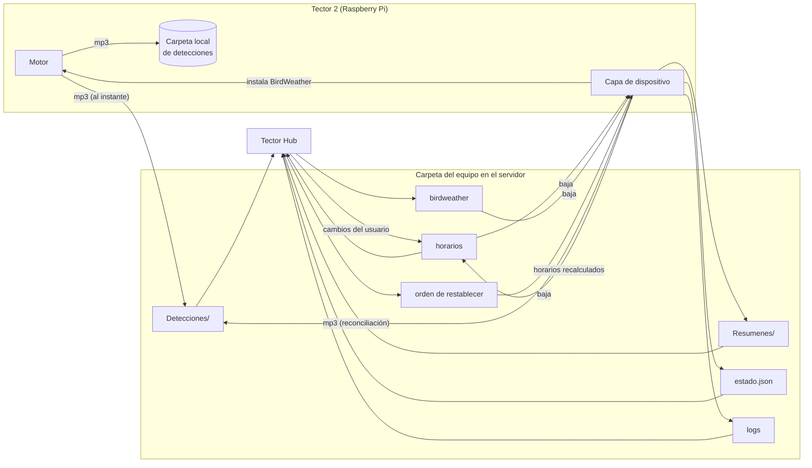
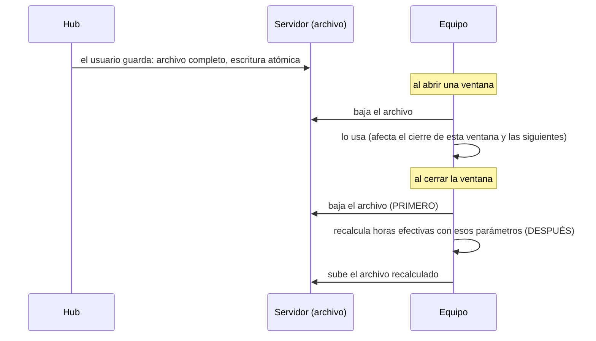

# Interfaces: los contratos entre capas

Las tres piezas de software de Tector 2 (la capa de dispositivo, el motor de detección y Tector Hub) **no se llaman
entre sí**. Se comunican a través de archivos con formato acordado, dejados en carpetas acordadas. Este documento
es la especificación de esos contratos: qué archivo existe, dónde vive, quién lo escribe, quién lo lee y qué
significa cada campo.

Mientras una pieza respete estos contratos, se la puede reescribir, actualizar o reemplazar sin tocar las demás.
Con este documento alcanza para escribir, por ejemplo, un analizador propio de los datos de un Tector, o un panel
alternativo al Hub.

## Índice

1. [Mapa general: quién escribe y quién lee](#mapa-general-quién-escribe-y-quién-lee)
2. [Reglas comunes a todos los archivos](#reglas-comunes-a-todos-los-archivos)
3. [Árbol de carpetas por equipo](#árbol-de-carpetas-por-equipo)
4. [Nombres de los archivos de detección](#nombres-de-los-archivos-de-detección)
5. [estado.json](#estadojson)
6. [Archivo de horarios](#archivo-de-horarios)
7. [Archivo de BirdWeather](#archivo-de-birdweather)
8. [Orden de restablecer y marca de restablecido](#orden-de-restablecer-y-marca-de-restablecido)
9. [Resumen diario](#resumen-diario)
10. [Logs](#logs)
11. [Contratos que no son archivos](#contratos-que-no-son-archivos)
12. [Compatibilidad y evolución](#compatibilidad-y-evolución)

## Mapa general: quién escribe y quién lee



| Contrato | Escribe | Lee | Cuándo se escribe | Cuándo se lee |
|---|---|---|---|---|
| Audio de detección (`.mp3`) | Motor (local y servidor); capa de dispositivo (reconciliación) | Capa de dispositivo (conteo, resumen, retención); Hub (cantos, estadísticas, reportes) | Al cerrarse cada evento detectado | Al cerrar ventana; cuando un usuario mira |
| Resumen diario (`.csv`) | Capa de dispositivo | Hub (estadísticas cuando el audio venció) | Al cerrar cada ventana con subida exitosa | A demanda |
| `estado.json` | Capa de dispositivo | Hub (página del equipo, vigilante de avisos) | Al abrir y cerrar ventana; al terminar la puesta en marcha | A demanda y periódicamente |
| Log del sistema y log reciente | Capa de dispositivo; motor (sólo líneas de alerta) | Hub (historial del equipo); personas del laboratorio | Al abrir y cerrar ventana y ante eventos | A demanda |
| Log de salud | Capa de dispositivo | Hub; laboratorio | Periódicamente con la Pi prendida; se sube al abrir y cerrar | A demanda |
| Log de batería | Capa de dispositivo (con el registro del supervisor) | Hub (curva de batería) | Al arrancar la Pi; se sube al abrir y cerrar | A demanda |
| Archivo de horarios | Hub (lo que pide el usuario); capa de dispositivo (horarios recalculados) | Capa de dispositivo; Hub (pantalla de horarios) | Al guardar en la aplicación; al cerrar ventana o terminar la puesta en marcha | Al abrir y cerrar ventana |
| Archivo de BirdWeather | Hub | Capa de dispositivo, que lo traduce para el motor | Al conectar o desconectar en la aplicación | Al abrir ventana |
| Orden de restablecer | Hub | Capa de dispositivo | Al pedirlo el propietario | En cada arranque |
| Marca de restablecido | Capa de dispositivo | Hub | Al aplicar la orden | A demanda |
| Registro del equipo (mensaje) | Capa de dispositivo | Hub | Al abrir y cerrar ventana | Al recibirlo |
| Reportes de audio | Hub (desde la aplicación) | Base de reentrenamiento (directo) | Al reportar | Al reentrenar |

## Reglas comunes a todos los archivos

- **Texto en UTF-8.** Los archivos de configuración usan el formato `CLAVE=valor`, una clave por línea, **sin
  espacios alrededor del `=`**; las líneas que empiezan con `#` son comentarios. Los nombres de las claves no se
  cambian.
- **Escritura atómica.** Quien escribe un archivo que otro puede estar leyendo lo escribe a un temporal y lo
  reemplaza con un renombre. Nadie ve nunca un archivo a medio escribir.
- **Ausente no es error.** Un archivo que no está (un equipo que nunca configuró BirdWeather, un equipo que todavía
  no subió su estado) es el caso normal y cada lector lo trata como "no hay nada que hacer" o "no se sabe todavía".
- **Valores rotos no rompen.** Un lector que encuentra un valor inválido (coordenadas que no son números, un JSON
  ilegible) lo ignora y sigue con lo que tenía. Un error de un lado no puede dejar sin funcionar al otro.
- **Horas.** Las marcas de "cuándo se escribió esto" van en UTC con formato ISO 8601. Los horarios de ventanas y
  las horas dentro de los nombres de archivo van en **hora local del equipo**, que es la que tiene sentido para
  un ave. El huso de un equipo se deduce de sus coordenadas.
- **Piso de fecha.** Toda fecha anterior a un piso fijo (el año de puesta en marcha del sistema) se considera
  imposible: es un reloj que se perdió. El equipo descarta esas detecciones antes de subirlas y el Hub no las
  cuenta.
- **La carpeta del equipo es su jaula.** El equipo sólo puede escribir dentro de su carpeta en el servidor y el Hub
  no resuelve ninguna ruta fuera de ella.

## Árbol de carpetas por equipo

En el servidor, cada equipo tiene una carpeta propia bajo una raíz de datos común. Dentro de ella, la carpeta de
datos que el equipo ve como su única carpeta escribible:

```
<raíz de datos>/
├── <equipo>/
│   └── data/
│       ├── Detecciones/
│       │   └── <AAAA-MM-DD>/
│       │       └── <Especie>/
│       │           └── <archivo de detección>.mp3
│       ├── Resumenes/
│       │   └── <AAAA-MM-DD>.csv
│       ├── estado.json
│       ├── log_sistema.txt
│       ├── log_reciente.txt
│       ├── log_salud.txt
│       ├── log_bateria.txt
│       ├── config_horarios.txt          (lo escriben el Hub y el equipo)
│       ├── config_birdweather.txt       (lo escribe el Hub; opcional)
│       ├── orden_restablecer.txt        (lo escribe el Hub; sólo si hay una orden pendiente)
│       └── restablecido.txt             (lo escribe el equipo; sólo tras aplicar una orden)
├── <otro equipo>/
│   └── data/ ...
└── hub/
    └── reportados/                       (copias de los audios reportados; la retención no las toca)
```

- `<equipo>` es un nombre de carpeta que asigna el servidor al dar de alta el equipo y que la base del Hub asocia
  con el número de serie. El equipo no lo conoce: para él, su carpeta es simplemente `data/`.
- `<Especie>` es el nombre común en inglés de la etiqueta del modelo, con los espacios reemplazados por `_` y sin
  apóstrofos.
- Una fecha es siempre una carpeta entera: la retención (en el equipo y en el servidor) borra días completos,
  nunca archivos sueltos de un día.

En el equipo, el motor deja sus detecciones en una carpeta local **con la misma estructura** `<fecha>/<Especie>/`.
Eso permite que la reconciliación del cierre de ventana sea una simple copia de árbol a árbol, que sólo transfiere
lo que falta.

## Nombres de los archivos de detección

El nombre del archivo **es** el registro de la detección. No hay otra base de datos de detecciones: tanto el equipo
como el Hub obtienen especie, confianza, fecha y hora leyendo el nombre.

```
<Especie>-<confianza>-<AAAA-MM-DD>-<marcador>-<hh:mm:ss>[-nbw].mp3
```

| Parte | Significado |
|---|---|
| `<Especie>` | Nombre común (inglés) de la especie ganadora, con `_` en lugar de espacios. Puede contener `-`, por eso se lee desde la derecha o con una expresión no codiciosa. |
| `<confianza>` | Confianza de la decisión, en por ciento, entero de 1 a 3 dígitos. |
| `<AAAA-MM-DD>` | Fecha local del inicio del evento. |
| `<marcador>` | Etiqueta fija del clasificador que produjo la detección. Separa la fecha de la hora y permite que los contadores encuentren la hora con un patrón simple. Los lectores aceptan también el marcador histórico de versiones anteriores. |
| `<hh:mm:ss>` | Hora local del **inicio del evento** (no de la escritura del archivo). Con `:` como separador a propósito: los contadores extraen `hh:mm` justo después del marcador. |
| `-nbw` | Opcional. Marca **evidencia débil**: la decisión se apoyó en una racha muy corta de ventanas dentro de un evento más largo. Estas detecciones se guardan y se suben, pero **no** se publican en BirdWeather ni se muestran en la aplicación. |

Patrón de lectura, en pseudocódigo:

```
especie   ← todo lo anterior a  -<número>-<fecha>-<marcador>-<hora>
confianza ← <número>
fecha     ← <fecha>
hora      ← <hora>
débil     ← el nombre termina en "-nbw" antes de la extensión
extensión ← mp3 (los lectores aceptan también formatos sin pérdida)
```

Ejemplo genérico: `Rufous_Hornero-92-2026-09-09-<marcador>-07:52:26.mp3` es un Hornero detectado con 92 % de
confianza en un evento que empezó a las 7:52:26 hora local del 9 de septiembre.

## estado.json

La "foto" del equipo que lee el Hub. Es chico, estable y pensado para un programa, no para una persona. Se reescribe
entero cada vez.

```json
{
  "version_formato": 1,
  "serie": "####",
  "generado": "AAAA-MM-DDThh:mm:ss+00:00",
  "estado": "grabando | en_espera",
  "ventana_activa": "amanecer | atardecer | null",
  "proxima_ventana": { "cual": "amanecer | atardecer", "hora": "hh:mm" },
  "cierre_forzado": false,
  "horarios": {
    "auto_sync": true,
    "amanecer":  { "inicio": "hh:mm", "fin": "hh:mm" },
    "atardecer": { "inicio": "hh:mm", "fin": "hh:mm" },
    "duracion_amanecer_h": "…",  "duracion_atardecer_h": "…",
    "offset_amanecer_min": "…",  "offset_atardecer_min": "…"
  },
  "ubicacion": { "lat": "…", "lon": "…" },
  "bateria": {
    "timestamp": "…",
    "voltaje_v": 0.0,
    "corriente_ma": 0.0,
    "carga_mah": 0.0,
    "temp_cpu_c": 0.0,
    "throttled": "0x0"
  },
  "umbral_bateria_v": "…",
  "detecciones_hoy": 0,
  "version_software": "abc1234",
  "software_actualizado": "AAAA-MM-DDThh:mm:ss",
  "disco": { "libre_gb": 0.0, "usado_pct": 0 }
}
```

| Campo | Significado | Lo usa el Hub para |
|---|---|---|
| `version_formato` | Versión del contrato. Cambia sólo si un campo existente cambia de significado. | Elegir cómo leer el resto. |
| `serie` | Número de serie de cuatro dígitos (ya corregido por el servidor si hubo colisión). | Asociar el archivo con el equipo. |
| `generado` | Cuándo escribió el equipo este archivo, en UTC. **No** cuándo lo leyó el Hub. | Decidir si el equipo está mudo. |
| `estado` | `grabando` si hay una ventana activa; `en_espera` si no. | Lo que la aplicación muestra junto al nombre. |
| `ventana_activa` | Cuál ventana está en curso, o `null`. | Ídem. |
| `proxima_ventana` | Si hay ventana activa: esa misma, con su hora de **fin**. Si no: la próxima que abre, con su hora de **inicio** (hora local). | Mostrar "próxima ventana" y detectar un equipo que no volvió: si pasó esa hora más una tolerancia sin estado nuevo, el equipo no se despertó. |
| `cierre_forzado` | La última ventana se cerró antes de tiempo por batería baja. | Aviso de batería. |
| `horarios` | Los horarios **vigentes** en el equipo (ya recalculados), con sus parámetros. | Comparar lo vigente con lo que pidió el usuario. |
| `ubicacion` | Coordenadas que usa el equipo. | Mapa, huso horario del equipo, líneas de amanecer y atardecer en estadísticas. |
| `bateria` | Última medición: tensión del pack, corriente (positiva cargando), carga acumulada, temperatura del procesador y estado de estrangulamiento (`0x0` es limpio; otro valor indica que hubo baja tensión o exceso de temperatura). Puede ser `null` si no hay mediciones. | Página del equipo; alerta de estrangulamiento. |
| `umbral_bateria_v` | Piso de batería con el que trabaja el supervisor. | Interpretar la curva de batería. |
| `detecciones_hoy` | Cuántos audios generó el motor en el día. | Resumen rápido. |
| `version_software` | Identificador corto del commit instalado de la capa de dispositivo. | Aviso de "software actualizado"; saber qué corre cada equipo. |
| `software_actualizado` | Cuándo se instaló esa versión. | Página del equipo. |
| `disco` | Espacio libre y porcentaje usado de la tarjeta. | Página del equipo. |

**Antigüedad normal.** Entre ventanas el equipo está apagado, así que este archivo *siempre* está viejo cuando el Hub
lo mira. Eso no es una falla. Un equipo se considera en problemas recién cuando pasó la próxima ventana anunciada
sin que el archivo se renueve.

**Lo que el Hub agrega al leerlo.** El huso horario del equipo (calculado de las coordenadas) no viaja en el
archivo: lo deduce el Hub con el mismo criterio que usa el equipo.

## Archivo de horarios

`config_horarios.txt`. Es el único archivo de configuración con **dos escritores**, así que su protocolo importa.

```
# comentarios libres
AUTO_SYNC=ON | OFF

# Si AUTO_SYNC=ON: parámetros del cálculo astronómico
OFFSET_AMANECER_SYNC=<minutos, con signo>
OFFSET_ATARDECER_SYNC=<minutos, con signo>
DURACION_AMANECER_SYNC=<horas, admite decimales>
DURACION_ATARDECER_SYNC=<horas, admite decimales>

# Horarios efectivos (hora local, hh:mm).
# Con AUTO_SYNC=ON los recalcula el equipo; con OFF se usan tal cual.
INICIO_AMANECER=hh:mm
FIN_AMANECER=hh:mm
INICIO_ATARDECER=hh:mm
FIN_ATARDECER=hh:mm

# Opcional: coordenadas puestas desde el Hub. Si están y son válidas,
# ganan sobre las de instalación.
LAT=<grados decimales>
LON=<grados decimales>
```

| Clave | Rango que acepta el Hub | Notas |
|---|---|---|
| `AUTO_SYNC` | `ON` / `OFF` | En `ON`, las cuatro horas efectivas son salida del cálculo, no entrada. |
| `OFFSET_*_SYNC` | Algunas horas hacia cada lado | Negativo adelanta la ventana respecto del sol. |
| `DURACION_*_SYNC` | Mayor que cero y hasta medio día | En la aplicación el usuario carga inicio y duración; el fin lo calcula el Hub. |
| `INICIO_*`, `FIN_*` | `hh:mm` | Siempre presentes: es lo que el equipo efectivamente usa para abrir y cerrar. |
| `LAT`, `LON` | Rangos geográficos válidos | Si no son números válidos, el equipo las ignora y sigue con las de instalación. |

Protocolo entre los dos escritores:



- El Hub reescribe el archivo **entero**: no guarda estado del equipo, sólo configuración.
- El equipo baja **antes** de recalcular y subir. Al revés, pisaría el cambio del usuario con su copia vieja.
- La hora de inicio de la ventana en curso ya se usó para despertar al equipo: un cambio de inicio rige desde la
  próxima ventana.
- Lo que el Hub muestra como "vigente" sale de `estado.json`, no de este archivo.

## Archivo de BirdWeather

`config_birdweather.txt`. Lo escribe sólo el Hub y es opcional.

```
BIRDWEATHER_ID=<token de la estación>
```

| Situación | Significado |
|---|---|
| Archivo ausente | La estación nunca se conectó. No hay nada que hacer. |
| Token con valor | Publicar las detecciones (salvo las de evidencia débil) en esa estación de BirdWeather. |
| Token vacío | El usuario desconectó la estación. El motor deja de publicar. |

El token es una credencial: el archivo vive sólo en la carpeta del equipo, y en los logs aparece a lo sumo su
comienzo.

El equipo **no** le pasa este archivo tal cual al motor. La capa de dispositivo lo traduce a la configuración del
motor agregándole **las coordenadas del propio equipo**, que nunca vienen del Hub. Sólo reinicia el motor si el
resultado cambió.

## Orden de restablecer y marca de restablecido

Dos archivos de presencia: importa que existan, no su contenido.

| Archivo | Escribe | Significado | Ciclo de vida |
|---|---|---|---|
| `orden_restablecer.txt` | Hub | "Borrate y volvé al modo de puesta en marcha." | Lo crea el Hub (después de borrar del servidor los datos y la configuración del equipo). El equipo lo borra al aplicarlo. |
| `restablecido.txt` | Equipo | "Ya me borré", con la fecha y hora UTC de aplicación. | Lo crea el equipo al aplicar la orden. Lo borra el equipo cuando termina la nueva puesta en marcha. |

Con esos dos archivos el Hub muestra tres estados: orden pendiente, aplicada (equipo esperando ser configurado de
nuevo) y equipo reconfigurado.

## Resumen diario

`Resumenes/<AAAA-MM-DD>.csv`. Una fila por detección del día, sin el audio. Es el dato científico permanente: pesa
del orden de kilobytes por día contra decenas de megabytes de audio, y no lo borra ninguna retención.

| Columna | Contenido |
|---|---|
| `fecha` | `AAAA-MM-DD` (local) |
| `hora` | `hh:mm:ss` (local, inicio del evento) |
| `especie` | Nombre común, con espacios |
| `confianza` | Entero, por ciento |
| `serie` | Número de serie del equipo |
| `archivo` | Nombre del archivo de audio original |
| `bytes` | Tamaño del audio |

- Ordenado por hora.
- CSV con encabezado, UTF-8 **con marca de orden de bytes**: estos archivos terminan abiertos en planillas de
  cálculo, y sin esa marca los acentos salen rotos.
- Se escribe al cerrar cada ventana, **antes** de cualquier limpieza de audio, y sólo si la subida del audio salió
  bien. El de un día se reescribe en el cierre del atardecer, ya con las dos ventanas.
- El Hub lo usa para todas las estadísticas de días cuyo audio ya venció.

## Logs

| Archivo | Formato | Contenido | Retención |
|---|---|---|---|
| `log_sistema.txt` | Texto, una línea por evento | Historia completa de ventanas, cambios y alertas | Rotación por tamaño en el equipo |
| `log_reciente.txt` | Ídem | Las líneas de hoy y de ayer, para no recorrer todo el historial | Se regenera en cada subida |
| `log_salud.txt` | CSV con encabezado | Salud de la Pi, muestreada periódicamente mientras está prendida | Rotación |
| `log_bateria.txt` | CSV con encabezado | Mediciones de batería, incluidas las que el supervisor hizo con la Pi apagada | Rotación |

### Log del sistema

Cada línea empieza con la marca de tiempo local entre corchetes, `[AAAA-MM-DD hh:mm]`, y sigue con un evento.
Formas:

```
[fecha hora] INICIO ventana <amanecer|atardecer> | Batería: <nivel> | Fin esperado: hh:mm
[fecha hora] FIN ventana <v> | Batería: <nivel> | Detecciones subidas: <n> | Próxima ventana: hh:mm
[fecha hora] FIN ventana <v> | SIN CONEXIÓN, archivos se subirán en la próxima ventana | Batería: <nivel> | Detecciones: <n> | Próxima ventana: hh:mm
[fecha hora] <mensaje libre>
[fecha hora] ALERTA: <descripción>
```

- Las líneas `INICIO` y `FIN` son las que el Hub parsea para reconstruir la historia de ventanas de un equipo.
- Las líneas `ALERTA:` señalan algo que necesita atención humana (el motor caído al cierre, un reloj que no se pudo
  ajustar). El motor escribe sus propias alertas **en este mismo log**, con el mismo
  formato, porque su log interno no sale del equipo.
- Los mensajes libres registran cambios de identidad (número de serie reasignado), configuración aplicada desde el
  Hub (sin el token completo), actualizaciones y similares.

### Log de salud

| Columna | Contenido |
|---|---|
| `timestamp` | Hora local de la muestra |
| `temp_cpu_c` | Temperatura del procesador |
| `throttled` | Indicadores de estrangulamiento del procesador (actuales y "ocurrido desde el arranque") |
| `load_avg_1min` | Carga del sistema |
| `cpu_mhz` | Frecuencia real del procesador |
| `uptime_s` | Tiempo desde el arranque (un valor que baja entre dos filas es un reinicio) |
| `disco_pct` | Uso de la tarjeta |
| `ram_disp_mb` | Memoria disponible |

### Log de batería

| Columna | Contenido |
|---|---|
| `timestamp` | Momento de la medición |
| `voltaje_v` | Tensión del pack |
| `corriente_ma` | Corriente de la batería (positiva cargando, negativa descargando) |
| `carga_mah` | Carga acumulada |
| `pi_prendida` | Si la medición se tomó con la Pi encendida o apagada |

El supervisor mide cada tanto mientras la Pi está apagada y guarda esas mediciones; la Pi se las pide al arrancar,
las agrega a este log y lo sube. Así la curva de batería del Hub cubre el día entero, no sólo las ventanas.

## Contratos que no son archivos

Tres intercambios son mensajes, no archivos. Se resumen acá para que el mapa esté completo.

### Registro del equipo

Del equipo al Hub, por la red privada, al abrir y al cerrar cada ventana:

```
pedido:     { serie: "####", id_hardware: "<identificador estable del procesador>" }
respuestas: { estado: "ok",         serie: "####" }   # libre, o ya era de este hardware
            { estado: "reasignado", serie: "####" }   # chocaba con otro hardware: usar este
            (error o sin respuesta)                     # no cambiar nada; reintentar en la próxima ventana
```

Es idempotente: el mismo hardware siempre recupera su número. Sólo se acepta desde la red privada.

### Enrolamiento

Del equipo al Hub, por el camino público, una sola vez en la vida del equipo: `{serie, token}` a cambio de una clave
de ingreso a la red privada de un solo uso. Detalle en [`5_hub`](../5_hub/#enrolamiento-de-un-equipo-nuevo).

### Pi y supervisor de energía

Mensajes cortos, enmarcados y verificados, con un único proceso dueño del canal en la Pi. Horas siempre en tiempo
Unix UTC. Lista completa en [`2_dispositivo`](../2_dispositivo/#interfaz-lógica-con-el-supervisor-de-energía).

### Reporte de audio

De la aplicación al Hub: `{ruta del audio, tipo, especie sugerida (código eBird, opcional), comentario
(opcional)}`. El Hub completa especie, confianza y fecha de la detección a partir del nombre del archivo y guarda
todo junto. Tipos y flujo en [`5_hub`](../5_hub/#reporte-de-audios-mal-etiquetados).

## Compatibilidad y evolución

- **Agregar campos es libre; cambiar su significado, no.** Un lector ignora los campos que no conoce. Si un campo
  existente tiene que cambiar de sentido, sube `version_formato`.
- **Los lectores son tolerantes con el pasado.** El Hub sigue leyendo equipos que nunca publicaron `estado.json`
  (reconstruye lo que puede a partir de las líneas `INICIO`/`FIN` del log) y nombres de archivo con marcadores
  históricos.
- **Los escritores son estrictos con el presente.** Cada escritor produce exactamente el formato de este documento,
  porque del otro lado hay lectores simples (en el equipo, a veces, una línea de shell).
- **El nombre del archivo es parte del contrato.** Cambiar cómo se nombra un audio rompe a tres lectores a la vez
  (contadores del equipo, resumen diario y Hub). Por eso cualquier agregado al nombre va en una posición que los
  lectores existentes no miran (como el sufijo de evidencia débil, después de la hora).
